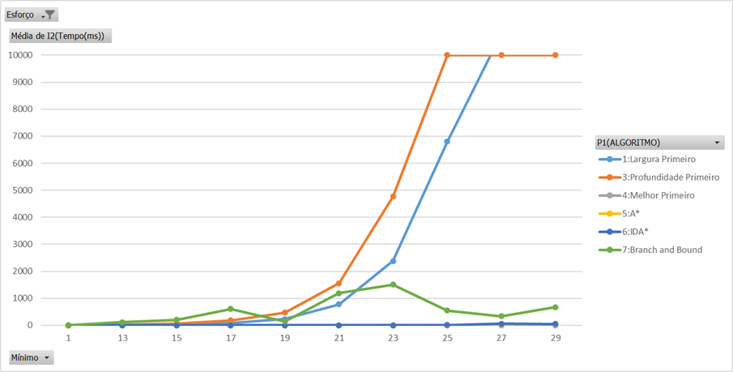
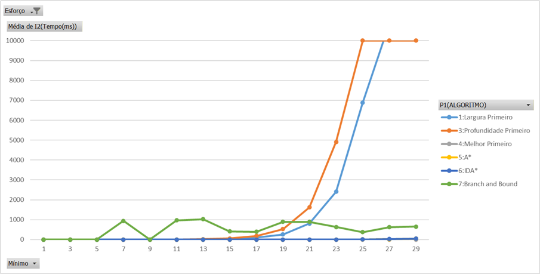
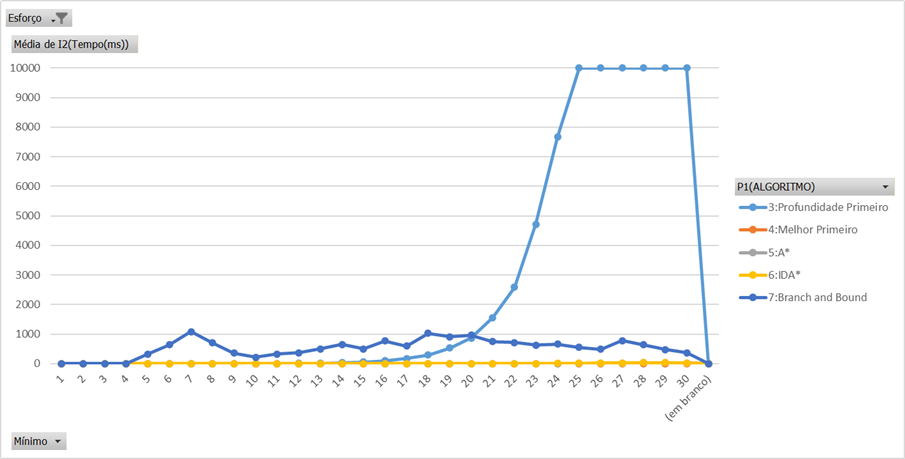

@page construtiva__deucalion Deucalion - testes construtivos

Testes da classe TProcuraConstrutiva no cluster Deucalion.

A documentação do cluster Deucalion pode ser encontrada em: https://docs.deucalion.macc.fccn.pt/
A forma como se pode obter acesso ao cluster, bem como a submissão de trabalhos, está descrita nessa documentação.

Vamos submeter os testes com os exemplos do puzzle 8, as 8 damas e partição, com todos os níveis de esforço (A, B e C), em modo MPI.

\htmlonly

  
Ver script: construtiva.sh

<pre>
#!/bin/bash
#SBATCH --job-name=construtiva
#SBATCH --output=Resultados/construtiva.txt
#SBATCH --account=f202507959cpcaa0a
#SBATCH --partition=normal-arm
#SBATCH --time=02:00:00
#SBATCH --nodes=1
#SBATCH --ntasks=48
#SBATCH --cpus-per-task=1
#SBATCH --mem=24G

ml OpenMPI

make mpi || { echo "Compilação falhou"; exit 1; }

# Teste: puzzle8_1
# esforço A
srun bin/MPI/TProcuraConstrutiva 2 1:1000:100 -R Resultados/puzzle8_1 -M 1 -P P2=3 P1=1,3:7 x P3=1:4
# esforço B
srun bin/MPI/TProcuraConstrutiva 2 1:1000:10 -R Resultados/puzzle8_1B -M 1 -P P2=3 P1=1,3:7 x P3=1:4
# esforço C
srun bin/MPI/TProcuraConstrutiva 2 1:1000 -R Resultados/puzzle8_1C -M 1 -P P2=2 P1=1,3:7 x P3=1:4

# Teste: 8damas_1
# esforço A
srun bin/MPI/TProcuraConstrutiva 3 4:40 -R Resultados/8damas_1 -M 1 -P P1=3 P2=4 P7=-1 P8=1,3

# Teste: 8damas_2
# esforço A
srun bin/MPI/TProcuraConstrutiva 3 4:40 -R Resultados/8damas_2 -M 1 -P P1=3 P2=3 P7=-1 P8=1 P11=0,1 x P3=1:4

# Teste: 8damas_3
# esforço A
srun bin/MPI/TProcuraConstrutiva 3 4:40 -R Resultados/8damas_3 -M 1 -P P1=3 P2=3 P7=-1 P8=1 P11=1 P3=1:10
# esforço B
srun bin/MPI/TProcuraConstrutiva 3 4:40 -R Resultados/8damas_3B -M 1 -P P1=3 P2=3 P7=-1 P8=1 P11=1 P3=1:100
# esforço C
srun bin/MPI/TProcuraConstrutiva 3 4:40 -R Resultados/8damas_3C -M 1 -P P1=3 P2=2 P7=-1 P8=1 P11=1 P3=1:1000

# Teste: particao_1
# esforço A
srun bin/MPI/TProcuraConstrutiva 4 2:200:20 -R Resultados/particao_1 -M 1 -P P1=3 P2=4 P7=-1 P3=1 P8=1,3
# esforço B
srun bin/MPI/TProcuraConstrutiva 4 2:200:20 -R Resultados/particao_1B -M 1 -P P1=3 P2=3 P7=-1 P3=1:10 x P8=1,3
# esforço C
srun bin/MPI/TProcuraConstrutiva 4 2:200:20 -R Resultados/particao_1C -M 1 -P P1=2 P2=2 P7=-1 P3=1:100 x P8=1,3

# Teste: particao_2
# esforço A
srun bin/MPI/TProcuraConstrutiva 4 2:100:10 -R Resultados/particao_2 -M 1 -P P1=3 P2=3 P7=-1 P8=3 P3=1:4 x P11=0,1
# esforço B
srun bin/MPI/TProcuraConstrutiva 4 2:100:10 -R Resultados/particao_2B -M 1 -P P1=3 P2=3 P7=-1 P8=3 P3=1:40 x P11=0,1
# esforço C
srun bin/MPI/TProcuraConstrutiva 4 2:100:10 -R Resultados/particao_2C -M 1 -P P1=3 P2=2 P7=-1 P8=3 P3=1:400 x P11=0,1

# Teste: particao_3

# esforço A
srun bin/MPI/TProcuraConstrutiva 4 2:1000:100 -R Resultados/particao_3 -M 1 -P P1=3 P2=3 P7=-1 P8=3 P11=1 P3=1:4
# esforço B
srun bin/MPI/TProcuraConstrutiva 4 2:1000:10 -R Resultados/particao_3B -M 1 -P P1=3 P2=3 P7=-1 P8=3 P11=1 P3=1:40
# esforço C
srun bin/MPI/TProcuraConstrutiva 4 2:1000 -R Resultados/particao_3C -M 1 -P P1=3 P2=2 P7=-1 P8=3 P11=1 P3=1:40
</pre>

Ver comandos no cluster

No cluster submetemos o trabalho com o comando:
<pre>
/TProcura/Construtiva/Teste$ sbatch construtiva.sh
</pre>
Podemos ver se o trabalho está em execução com:
<pre>
/TProcura/Construtiva/Teste$ squeue --me
</pre>
Para verificar o output do trabalho, mesmo durante a execução, consultamos o ficheiro Resultados/construtiva.txt vendo o final do ficheiro
<pre>
/TProcura/Construtiva/Teste$ tail -f Resultados/construtiva.txt
</pre>

  
Ver execução:

<pre>
mpic++ -Wall -O3 -DMPI_ATIVO -o bin/MPI/TProcuraConstrutiva ../../TProcura.cpp ../../TRand.cpp ../CListaNo.cpp ../TProcuraConstrutiva.cpp Puzzle8.cpp OitoDamas.cpp teste.cpp Particao.cpp Aspirador.cpp

═╤═ Instâncias ═══ { 📄 1 📄 101 📄 201 📄 301 📄 401 📄 501 📄 601 📄 701 📄 801 📄 901 } 
 ├─ 🛠️  ─ P2=3 P4=10 P5=0 P6=4 P7=0 P8=2 P11=0 (parâmetros comuns)
═╪═ Configurações ═══
 ├─ ⚙  [1] ─ P1=1 P3=1
 ├─ ⚙  [2] ─ P1=3 P3=1
 ├─ ⚙  [3] ─ P1=4 P3=1
 │ ...
 ├─ ⚙  [22] ─ P1=5 P3=4
 ├─ ⚙  [23] ─ P1=6 P3=4
 ├─ ⚙  [24] ─ P1=7 P3=4
═╧═══════════════════
═╤═ 🧪  Início do Teste (🖥️ 0) ═══
 ├─ 📋 Tarefas:240   📄 Instâncias: 10   🛠️ Configurações: 24   🖥️ Processos: 48.
 ├─ ⏱ 10" 1ms         📋 240   📄 401   🛠️ 19    🖥️ 2     ⚖  -2 10000 0 2741174 4695355 0 
 ├─ 📑  Ficheiro Resultados/puzzle8_1.csv gravado.
 │  ⏱  Tempo real: 11" 165ms 
 │  ⏱  CPU total: 8' 44" 777ms 
 │  ⏱  Espera do gestor: 11" 160ms 
 │  ⏱  Espera trabalhadores: 5' 36" 881ms 
 │  📊  Utilização:
 │  - Total: 35.0%
 │  - Gestor: 0.0%
 │  - Trabalhadores: 35.8% 
═╧═ 🏁  Fim do Teste (🖥️ 0  ⏱ 11" 165ms ) ═══

═╤═ Instâncias ═══ { 📄 1 📄 11 📄 21 … 📄 971 📄 981 📄 991 } #100
 ├─ 🛠️  ─ P2=3 P4=10 P5=0 P6=4 P7=0 P8=2 P11=0 (parâmetros comuns)
═╪═ Configurações ═══
 ├─ ⚙  [1] ─ P1=1 P3=1
 ├─ ⚙  [2] ─ P1=3 P3=1
 ├─ ⚙  [3] ─ P1=4 P3=1
 │ ...
 ├─ ⚙  [22] ─ P1=5 P3=4
 ├─ ⚙  [23] ─ P1=6 P3=4
 ├─ ⚙  [24] ─ P1=7 P3=4
═╧═══════════════════
═╤═ 🧪  Início do Teste (🖥️ 0) ═══
 ├─ 📋 Tarefas:2400   📄 Instâncias: 100   🛠️ Configurações: 24   🖥️ Processos: 48.
 ├─ ⏱ 10" 7ms         📋 654   📄 221   🛠️ 18    🖥️ 38    ⚖  23 2617 0 570615 1000206 0 
 ├─ ⏱ 20" 20ms        📋 1156  📄 691   🛠️ 12    🖥️ 12    ⚖  23 2652 0 582659 1024257 0 
 ├─ ⏱ 30" 205ms       📋 1714  📄 931   🛠️ 6     🖥️ 40    ⚖  21 988 0 211421 375296 25 
 ├─ ⏱ 40" 282ms       📋 2243  📄 761   🛠️ 1     🖥️ 7     ⚖  19 619 0 166486 289688 9 
 ├─ ⏱ 50" 306ms       📋 2400  📄 551   🛠️ 1     🖥️ 41    ⚖  -2 10000 0 2601566 4464353 0 
 ├─ 📑  Ficheiro Resultados/puzzle8_1B.csv gravado.
 │  ⏱  Tempo real: 57" 372ms 
 │  ⏱  CPU total: 44' 56" 502ms 
 │  ⏱  Espera do gestor: 57" 334ms 
 │  ⏱  Espera trabalhadores: 4' 30" 813ms 
 │  📊  Utilização:
 │  - Total: 88.1%
 │  - Gestor: 0.0%
 │  - Trabalhadores: 90.0% 
═╧═ 🏁  Fim do Teste (🖥️ 0  ⏱ 57" 372ms ) ═══

═╤═ Instâncias ═══ { 📄 1 📄 2 📄 3 … 📄 998 📄 999 📄 1000 } #1000
 ├─ 🛠️  ─ P2=2 P4=10 P5=0 P6=4 P7=0 P8=2 P11=0 (parâmetros comuns)
═╪═ Configurações ═══
 ├─ ⚙  [1] ─ P1=1 P3=1
 ├─ ⚙  [2] ─ P1=3 P3=1
 ├─ ⚙  [3] ─ P1=4 P3=1
 │ ...
 ├─ ⚙  [22] ─ P1=5 P3=4
 ├─ ⚙  [23] ─ P1=6 P3=4
 ├─ ⚙  [24] ─ P1=7 P3=4
═╧═══════════════════
═╤═ 🧪  Início do Teste (🖥️ 0) ═══
 ├─ 📋 Tarefas:24000   📄 Instâncias: 1000   🛠️ Configurações: 24   🖥️ Processos: 48.
slurmstepd: error: Detected 1 oom_kill event in StepId=636184.2. Some of the step tasks have been OOM Killed.
srun: error: cna1632: task 27: Out Of Memory
slurmstepd: error:  mpi/pmix_v4: _errhandler: cna1632 [0]: pmixp_client_v2.c:212: Error handler invoked: status = -61, source = [slurm.pmix.636184.2:27]
srun: Job step aborted: Waiting up to 32 seconds for job step to finish.
slurmstepd: error: *** STEP 636184.2 ON cna1632 CANCELLED AT 2025-11-07T11:19:15 ***
 ├─ ⏱ 1' 568ms        📋 4693  📄 350   🛠️ 19    🖥️ 43    ⚖  24 8259 0 2118081 3679711 1 

═╤═ Instâncias ═══ { 📄 4 📄 5 📄 6 … 📄 38 📄 39 📄 40 } #37
 ├─ 🛠️  ─ P1=3 P2=4 P3=1 P4=10 P5=0 P6=4 P7=-1 P11=0 (parâmetros comuns)
═╪═ Configurações ═══
 ├─ ⚙  [1] ─ P8=1
 ├─ ⚙  [2] ─ P8=3
═╧═══════════════════
═╤═ 🧪  Início do Teste (🖥️ 0) ═══
 ├─ 📋 Tarefas:74   📄 Instâncias: 37   🛠️ Configurações: 2   🖥️ Processos: 48.
 ├─ ⏱ 16ms            📋 47    📄 5     🛠️ 1     🖥️ 12    ⚖  5 15 0 5 9 0 
 ├─ ⏱ 16ms            📋 48    📄 6     🛠️ 1     🖥️ 13    ⚖  6 15 0 31 36 0 
 ├─ ⏱ 17ms            📋 49    📄 10    🛠️ 1     🖥️ 17    ⚖  10 16 0 102 119 0 
 ├─ ⏱ 17ms            📋 50    📄 7     🛠️ 1     🖥️ 14    ⚖  7 16 0 9 19 0 
 ├─ ⏱ 17ms            📋 51    📄 8     🛠️ 1     🖥️ 15    ⚖  8 16 0 113 120 0 
 ├─ ⏱ 17ms            📋 52    📄 4     🛠️ 1     🖥️ 11    ⚖  4 15 0 8 8 0 
 ├─ ⏱ 17ms            📋 53    📄 11    🛠️ 1     🖥️ 18    ⚖  11 17 0 52 78 0 
 ├─ ⏱ 17ms            📋 54    📄 9     🛠️ 1     🖥️ 16    ⚖  9 17 0 41 56 0 
 ├─ ⏱ 18ms            📋 55    📄 12    🛠️ 1     🖥️ 19    ⚖  12 17 0 261 289 0 
 ├─ ⏱ 27ms            📋 56    📄 15    🛠️ 1     🖥️ 22    ⚖  15 27 0 1359 1407 0 
 ├─ ⏱ 31ms            📋 57    📄 14    🛠️ 1     🖥️ 21    ⚖  14 30 0 1899 1937 0 
 ├─ ⏱ 32ms            📋 58    📄 13    🛠️ 1     🖥️ 20    ⚖  13 17 0 111 148 0 
 ├─ ⏱ 41ms            📋 59    📄 19    🛠️ 0     🖥️ 20    ⚖  19 9 0 2545 2642 0 
 ├─ ⏱ 45ms            📋 60    📄 16    🛠️ 1     🖥️ 23    ⚖  16 45 0 2850 2896 0 
 ├─ ⏱ 58ms            📋 61    📄 21    🛠️ 0     🖥️ 22    ⚖  21 32 0 8562 8676 0 
 ├─ ⏱ 62ms            📋 62    📄 17    🛠️ 0     🖥️ 23    ⚖  17 17 0 5374 5449 0 
 ├─ ⏱ 66ms            📋 63    📄 15    🛠️ 0     🖥️ 23    ⚖  15 4 0 1359 1414 0 
 ├─ ⏱ 72ms            📋 64    📄 14    🛠️ 0     🖥️ 23    ⚖  14 6 0 1899 1944 0 
 ├─ ⏱ 72ms            📋 65    📄 13    🛠️ 0     🖥️ 23    ⚖  13 0 0 111 154 0 
 ├─ ⏱ 73ms            📋 66    📄 12    🛠️ 0     🖥️ 23    ⚖  12 1 0 261 295 0 
 ├─ ⏱ 73ms            📋 67    📄 11    🛠️ 0     🖥️ 23    ⚖  11 0 0 52 83 0 
 ├─ ⏱ 73ms            📋 68    📄 10    🛠️ 0     🖥️ 23    ⚖  10 0 0 102 124 0 
 ├─ ⏱ 73ms            📋 69    📄 9     🛠️ 0     🖥️ 23    ⚖  9 0 0 41 60 0 
 ├─ ⏱ 74ms            📋 70    📄 8     🛠️ 0     🖥️ 23    ⚖  8 0 0 113 124 0 
 ├─ ⏱ 74ms            📋 71    📄 7     🛠️ 0     🖥️ 23    ⚖  7 0 0 9 22 0 
 ├─ ⏱ 74ms            📋 72    📄 6     🛠️ 0     🖥️ 23    ⚖  6 0 0 31 39 0 
 ├─ ⏱ 74ms            📋 73    📄 5     🛠️ 0     🖥️ 23    ⚖  5 0 0 5 11 0 
 ├─ ⏱ 74ms            📋 74    📄 4     🛠️ 0     🖥️ 23    ⚖  4 0 0 8 10 0 
 ├─ ⏱ 76ms            📋 74    📄 19    🛠️ 1     🖥️ 26    ⚖  19 77 0 4656 4733 0 
 ├─ ⏱ 76ms            📋 74    📄 17    🛠️ 1     🖥️ 24    ⚖  17 77 0 5206 5258 0 
 ├─ ⏱ 89ms            📋 74    📄 16    🛠️ 0     🖥️ 22    ⚖  16 32 0 10052 10112 0 
 ├─ ⏱ 115ms           📋 74    📄 23    🛠️ 0     🖥️ 16    ⚖  23 101 0 25428 25566 0 
 ├─ ⏱ 192ms           📋 74    📄 18    🛠️ 0     🖥️ 20    ⚖  18 140 0 41299 41377 0 
 ├─ ⏱ 216ms           📋 74    📄 25    🛠️ 0     🖥️ 11    ⚖  25 201 0 48683 48858 0 
 ├─ ⏱ 274ms           📋 74    📄 21    🛠️ 1     🖥️ 28    ⚖  21 276 0 20208 20295 0 
 ├─ ⏱ 345ms           📋 74    📄 18    🛠️ 1     🖥️ 25    ⚖  18 347 0 28605 28659 0 
 ├─ ⏱ 751ms           📋 74    📄 20    🛠️ 0     🖥️ 21    ⚖  20 724 0 199635 199733 0 
 ├─ ⏱ 1" 366ms        📋 74    📄 20    🛠️ 1     🖥️ 27    ⚖  20 1370 0 112596 112672 0 
 ├─ ⏱ 1" 718ms        📋 74    📄 24    🛠️ 0     🖥️ 18    ⚖  24 1705 0 411608 411755 0 
 ├─ ⏱ 1" 725ms        📋 74    📄 26    🛠️ 0     🖥️ 15    ⚖  26 1712 0 397699 397880 0 
 ├─ ⏱ 2" 58ms         📋 74    📄 27    🛠️ 0     🖥️ 14    ⚖  27 2046 0 454213 454418 0 
 ├─ ⏱ 3" 626ms        📋 74    📄 23    🛠️ 1     🖥️ 30    ⚖  23 3629 0 250250 250347 0 
 ├─ ⏱ 5" 751ms        📋 74    📄 22    🛠️ 1     🖥️ 29    ⚖  22 5758 0 425154 425243 0 
 ├─ ⏱ 6" 562ms        📋 74    📄 22    🛠️ 0     🖥️ 19    ⚖  22 6553 0 1737188 1737308 0 
 ├─ ⏱ 7" 253ms        📋 74    📄 29    🛠️ 0     🖥️ 13    ⚖  29 7278 0 1532239 1532471 0 
 ├─ ⏱ 7" 899ms        📋 74    📄 24    🛠️ 1     🖥️ 31    ⚖  24 7941 0 534849 534950 0 
 ├─ ⏱ 9" 675ms        📋 74    📄 25    🛠️ 1     🖥️ 32    ⚖  25 9718 0 602361 602468 0 
 ├─ ⏱ 9" 957ms        📋 74    📄 32    🛠️ 0     🖥️ 2     ⚖  -2 10000 0 1951068 1951348 0 
 ├─ ⏱ 9" 957ms        📋 74    📄 37    🛠️ 0     🖥️ 7     ⚖  -2 10001 0 1700753 1701139 0 
 ├─ ⏱ 9" 957ms        📋 74    📄 36    🛠️ 0     🖥️ 6     ⚖  -2 10001 0 1752606 1752975 0 
 ├─ ⏱ 9" 957ms        📋 74    📄 33    🛠️ 0     🖥️ 3     ⚖  -2 10000 0 1918643 1918944 0 
 ├─ ⏱ 9" 957ms        📋 74    📄 35    🛠️ 0     🖥️ 5     ⚖  -2 10001 0 1791256 1791612 0 
 ├─ ⏱ 9" 958ms        📋 74    📄 40    🛠️ 0     🖥️ 10    ⚖  -2 10001 0 1552370 1552827 0 
 ├─ ⏱ 9" 958ms        📋 74    📄 39    🛠️ 0     🖥️ 9     ⚖  -2 10001 0 1599247 1599676 0 
 ├─ ⏱ 9" 958ms        📋 74    📄 31    🛠️ 0     🖥️ 1     ⚖  -2 10001 0 2012270 2012533 0 
 ├─ ⏱ 9" 958ms        📋 74    📄 38    🛠️ 0     🖥️ 8     ⚖  -2 10001 0 1637645 1638055 0 
 ├─ ⏱ 9" 965ms        📋 74    📄 31    🛠️ 1     🖥️ 38    ⚖  -2 10011 0 411971 412136 0 
 ├─ ⏱ 9" 965ms        📋 74    📄 30    🛠️ 1     🖥️ 37    ⚖  -2 10011 0 453089 453246 0 
 ├─ ⏱ 9" 965ms        📋 74    📄 26    🛠️ 1     🖥️ 33    ⚖  -2 10011 0 569098 569221 0 
 ├─ ⏱ 9" 965ms        📋 74    📄 34    🛠️ 1     🖥️ 41    ⚖  -2 10011 0 291318 291495 0 
 ├─ ⏱ 9" 965ms        📋 74    📄 40    🛠️ 1     🖥️ 47    ⚖  -2 10012 0 254231 254457 0 
 ├─ ⏱ 9" 965ms        📋 74    📄 39    🛠️ 1     🖥️ 46    ⚖  -2 10012 0 247505 247724 0 
 ├─ ⏱ 9" 965ms        📋 74    📄 27    🛠️ 1     🖥️ 34    ⚖  -2 10011 0 528385 528519 0 
 ├─ ⏱ 9" 965ms        📋 74    📄 35    🛠️ 1     🖥️ 42    ⚖  -2 10011 0 283279 283475 0 
 ├─ ⏱ 9" 965ms        📋 74    📄 38    🛠️ 1     🖥️ 45    ⚖  -2 10011 0 254457 254660 0 
 ├─ ⏱ 9" 965ms        📋 74    📄 28    🛠️ 1     🖥️ 35    ⚖  -2 10011 0 511602 511739 0 
 ├─ ⏱ 9" 965ms        📋 74    📄 32    🛠️ 1     🖥️ 39    ⚖  -2 10011 0 333410 333572 0 
 ├─ ⏱ 9" 966ms        📋 74    📄 29    🛠️ 1     🖥️ 36    ⚖  -2 10011 0 484125 484287 0 
 ├─ ⏱ 9" 969ms        📋 74    📄 36    🛠️ 1     🖥️ 43    ⚖  -2 10011 0 286797 286989 0 
 ├─ ⏱ 9" 970ms        📋 74    📄 28    🛠️ 0     🖥️ 17    ⚖  -2 10000 0 2148429 2148657 0 
 ├─ ⏱ 9" 995ms        📋 74    📄 37    🛠️ 1     🖥️ 44    ⚖  -2 10012 0 274142 274346 0 
 ├─ ⏱ 10" 8ms         📋 74    📄 30    🛠️ 0     🖥️ 12    ⚖  -2 10000 0 2065922 2066171 0 
 ├─ ⏱ 10" 14ms        📋 74    📄 34    🛠️ 0     🖥️ 4     ⚖  -2 10001 0 1862992 1863308 0 
 ├─ ⏱ 10" 27ms        📋 74    📄 33    🛠️ 1     🖥️ 40    ⚖  -2 10011 0 307425 307605 0 
 ├─ 📑  Ficheiro Resultados/8damas_1.csv gravado.
 │  ⏱  Tempo real: 10" 29ms 
 │  ⏱  CPU total: 7' 51" 340ms 
 │  ⏱  Espera do gestor: 10" 24ms 
 │  ⏱  Espera trabalhadores: 2' 32" 272ms 
 │  📊  Utilização:
 │  - Total: 66.3%
 │  - Gestor: 0.0%
 │  - Trabalhadores: 67.7% 
═╧═ 🏁  Fim do Teste (🖥️ 0  ⏱ 10" 29ms ) ═══

═╤═ Instâncias ═══ { 📄 4 📄 5 📄 6 … 📄 38 📄 39 📄 40 } #37
 ├─ 🛠️  ─ P1=3 P2=3 P4=10 P5=0 P6=4 P7=-1 P8=1  (parâmetros comuns)
═╪═ Configurações ═══
 ├─ ⚙  [1] ─ P3=1 P11=0
 ├─ ⚙  [2] ─ P3=1 P11=1
 ├─ ⚙  [3] ─ P3=2 P11=0
 ├─ ⚙  [4] ─ P3=2 P11=1
 ├─ ⚙  [5] ─ P3=3 P11=0
 ├─ ⚙  [6] ─ P3=3 P11=1
 ├─ ⚙  [7] ─ P3=4 P11=0
 ├─ ⚙  [8] ─ P3=4 P11=1
═╧═══════════════════
═╤═ 🧪  Início do Teste (🖥️ 0) ═══
 ├─ 📋 Tarefas:296   📄 Instâncias: 37   🛠️ Configurações: 8   🖥️ Processos: 48.
 ├─ ⏱ 10" 1ms         📋 296   📄 19    🛠️ 0     🖥️ 7     ⚖  19 9 0 2545 2642 0 
 ├─ 📑  Ficheiro Resultados/8damas_2.csv gravado.
 │  ⏱  Tempo real: 19" 992ms 
 │  ⏱  CPU total: 15' 39" 619ms 
 │  ⏱  Espera do gestor: 19" 986ms 
 │  ⏱  Espera trabalhadores: 6' 16" 517ms 
 │  📊  Utilização:
 │  - Total: 58.7%
 │  - Gestor: 0.0%
 │  - Trabalhadores: 59.9% 
═╧═ 🏁  Fim do Teste (🖥️ 0  ⏱ 19" 992ms ) ═══

═╤═ Instâncias ═══ { 📄 4 📄 5 📄 6 … 📄 38 📄 39 📄 40 } #37
 ├─ 🛠️  ─ P1=3 P2=3 P4=10 P5=0 P6=4 P7=-1 P8=1 P11=1 (parâmetros comuns)
═╪═ Configurações ═══
 ├─ ⚙  [1] ─ P3=1
 ├─ ⚙  [2] ─ P3=2
 ├─ ⚙  [3] ─ P3=3
 ├─ ⚙  [4] ─ P3=4
 ├─ ⚙  [5] ─ P3=5
 ├─ ⚙  [6] ─ P3=6
 ├─ ⚙  [7] ─ P3=7
 ├─ ⚙  [8] ─ P3=8
 ├─ ⚙  [9] ─ P3=9
 ├─ ⚙  [10] ─ P3=10
═╧═══════════════════
═╤═ 🧪  Início do Teste (🖥️ 0) ═══
 ├─ 📋 Tarefas:370   📄 Instâncias: 37   🛠️ Configurações: 10   🖥️ Processos: 48.
 ├─ 📑  Ficheiro Resultados/8damas_3.csv gravado.
 │  ⏱  Tempo real: 690ms 
 │  ⏱  CPU total: 32" 438ms 
 │  ⏱  Espera do gestor: 684ms 
 │  ⏱  Espera trabalhadores: 29" 90ms 
 │  📊  Utilização:
 │  - Total: 9.7%
 │  - Gestor: 0.5%
 │  - Trabalhadores: 9.9% 
═╧═ 🏁  Fim do Teste (🖥️ 0  ⏱ 690ms ) ═══

═╤═ Instâncias ═══ { 📄 4 📄 5 📄 6 … 📄 38 📄 39 📄 40 } #37
 ├─ 🛠️  ─ P1=3 P2=3 P4=10 P5=0 P6=4 P7=-1 P8=1 P11=1 (parâmetros comuns)
═╪═ Configurações ═══
 ├─ ⚙  [1] ─ P3=1
 ├─ ⚙  [2] ─ P3=2
 ├─ ⚙  [3] ─ P3=3
 │ ...
 ├─ ⚙  [98] ─ P3=98
 ├─ ⚙  [99] ─ P3=99
 ├─ ⚙  [100] ─ P3=100
═╧═══════════════════
═╤═ 🧪  Início do Teste (🖥️ 0) ═══
 ├─ 📋 Tarefas:3700   📄 Instâncias: 37   🛠️ Configurações: 100   🖥️ Processos: 48.
 ├─ 📑  Ficheiro Resultados/8damas_3B.csv gravado.
 │  ⏱  Tempo real: 8" 537ms 
 │  ⏱  CPU total: 6' 41" 237ms 
 │  ⏱  Espera do gestor: 8" 488ms 
 │  ⏱  Espera trabalhadores: 5' 55" 484ms 
 │  📊  Utilização:
 │  - Total: 10.9%
 │  - Gestor: 0.3%
 │  - Trabalhadores: 11.2% 
═╧═ 🏁  Fim do Teste (🖥️ 0  ⏱ 8" 537ms ) ═══

═╤═ Instâncias ═══ { 📄 4 📄 5 📄 6 … 📄 38 📄 39 📄 40 } #37
 ├─ 🛠️  ─ P1=3 P2=2 P4=10 P5=0 P6=4 P7=-1 P8=1 P11=1 (parâmetros comuns)
═╪═ Configurações ═══
 ├─ ⚙  [1] ─ P3=1
 ├─ ⚙  [2] ─ P3=2
 ├─ ⚙  [3] ─ P3=3
 │ ...
 ├─ ⚙  [998] ─ P3=998
 ├─ ⚙  [999] ─ P3=999
 ├─ ⚙  [1000] ─ P3=1000
═╧═══════════════════
═╤═ 🧪  Início do Teste (🖥️ 0) ═══
 ├─ 📋 Tarefas:37000   📄 Instâncias: 37   🛠️ Configurações: 1000   🖥️ Processos: 48.
 ├─ 📑  Ficheiro Resultados/8damas_3C.csv gravado.
 │  ⏱  Tempo real: 15" 403ms 
 │  ⏱  CPU total: 12' 3" 944ms 
 │  ⏱  Espera do gestor: 14" 925ms 
 │  ⏱  Espera trabalhadores: 5' 53" 476ms 
 │  📊  Utilização:
 │  - Total: 49.4%
 │  - Gestor: 1.6%
 │  - Trabalhadores: 50.4% 
═╧═ 🏁  Fim do Teste (🖥️ 0  ⏱ 15" 403ms ) ═══

═╤═ Instâncias ═══ { 📄 2 📄 22 📄 42 📄 62 📄 82 📄 102 📄 122 📄 142 📄 162 📄 182 } 
 ├─ 🛠️  ─ P1=3 P2=4 P3=1 P4=10 P5=0 P6=4 P7=-1 P11=0 (parâmetros comuns)
═╪═ Configurações ═══
 ├─ ⚙  [1] ─ P8=1
 ├─ ⚙  [2] ─ P8=3
═╧═══════════════════
═╤═ 🧪  Início do Teste (🖥️ 0) ═══
 ├─ 📋 Tarefas:20   📄 Instâncias: 10   🛠️ Configurações: 2   🖥️ Processos: 48.
 ├─ ⏱ 1ms             📋 20    📄 2     🛠️ 0     🖥️ 28    ⚖  -1 0 0 3 2 0 
 ├─ ⏱ 22ms            📋 20    📄 2     🛠️ 1     🖥️ 38    ⚖  -1 21 0 2 1 0 
 ├─ ⏱ 36ms            📋 20    📄 22    🛠️ 1     🖥️ 39    ⚖  22 35 0 4189 4199 0 
 ├─ ⏱ 209ms           📋 20    📄 42    🛠️ 1     🖥️ 40    ⚖  42 208 0 51162 51182 0 
 ├─ ⏱ 210ms           📋 20    📄 22    🛠️ 0     🖥️ 29    ⚖  22 210 0 77893 77904 0 
 ├─ ⏱ 927ms           📋 20    📄 62    🛠️ 1     🖥️ 41    ⚖  62 926 0 230596 230626 0 
 ├─ ⏱ 3" 180ms        📋 20    📄 82    🛠️ 1     🖥️ 42    ⚖  82 3180 0 732439 732479 0 
 ├─ ⏱ 9" 999ms        📋 20    📄 42    🛠️ 0     🖥️ 30    ⚖  -2 10000 0 3552994 3553014 0 
 ├─ ⏱ 9" 999ms        📋 20    📄 62    🛠️ 0     🖥️ 31    ⚖  -2 10000 0 3413876 3413906 0 
 ├─ ⏱ 9" 999ms        📋 20    📄 102   🛠️ 0     🖥️ 33    ⚖  -2 10000 0 3161710 3161758 0 
 ├─ ⏱ 9" 999ms        📋 20    📄 142   🛠️ 0     🖥️ 35    ⚖  -2 10000 0 2981903 2981972 0 
 ├─ ⏱ 9" 999ms        📋 20    📄 82    🛠️ 0     🖥️ 32    ⚖  -2 10000 0 3284154 3284194 0 
 ├─ ⏱ 9" 999ms        📋 20    📄 182   🛠️ 0     🖥️ 37    ⚖  -2 10000 0 2802476 2802566 0 
 ├─ ⏱ 10" 1ms         📋 20    📄 122   🛠️ 0     🖥️ 34    ⚖  -2 10000 0 3078493 3078552 0 
 ├─ ⏱ 10" 1ms         📋 20    📄 162   🛠️ 0     🖥️ 36    ⚖  -2 10000 0 2868931 2869012 0 
 ├─ ⏱ 10" 10ms        📋 20    📄 122   🛠️ 1     🖥️ 44    ⚖  -2 10011 0 2222973 2223020 0 
 ├─ ⏱ 10" 10ms        📋 20    📄 102   🛠️ 1     🖥️ 43    ⚖  -2 10011 0 2277855 2277893 0 
 ├─ ⏱ 10" 10ms        📋 20    📄 162   🛠️ 1     🖥️ 46    ⚖  -2 10011 0 2186436 2186510 0 
 ├─ ⏱ 10" 11ms        📋 20    📄 142   🛠️ 1     🖥️ 45    ⚖  -2 10011 0 2194619 2194672 0 
 ├─ ⏱ 10" 11ms        📋 20    📄 182   🛠️ 1     🖥️ 47    ⚖  -2 10011 0 2126234 2126313 0 
 ├─ 📑  Ficheiro Resultados/particao_1.csv gravado.
 │  ⏱  Tempo real: 10" 12ms 
 │  ⏱  CPU total: 7' 50" 561ms 
 │  ⏱  Espera do gestor: 10" 9ms 
 │  ⏱  Espera trabalhadores: 5' 35" 871ms 
 │  📊  Utilização:
 │  - Total: 28.0%
 │  - Gestor: 0.0%
 │  - Trabalhadores: 28.6% 
═╧═ 🏁  Fim do Teste (🖥️ 0  ⏱ 10" 12ms ) ═══

═╤═ Instâncias ═══ { 📄 2 📄 22 📄 42 📄 62 📄 82 📄 102 📄 122 📄 142 📄 162 📄 182 } 
 ├─ 🛠️  ─ P1=3 P2=3 P4=10 P5=0 P6=4 P7=-1 P11=0 (parâmetros comuns)
═╪═ Configurações ═══
 ├─ ⚙  [1] ─ P3=1 P8=1
 ├─ ⚙  [2] ─ P3=2 P8=1
 ├─ ⚙  [3] ─ P3=3 P8=1
 │ ...
 ├─ ⚙  [18] ─ P3=8 P8=3
 ├─ ⚙  [19] ─ P3=9 P8=3
 ├─ ⚙  [20] ─ P3=10 P8=3
═╧═══════════════════
═╤═ 🧪  Início do Teste (🖥️ 0) ═══
 ├─ 📋 Tarefas:200   📄 Instâncias: 10   🛠️ Configurações: 20   🖥️ Processos: 48.
 ├─ ⏱ 10" 7ms         📋 94    📄 122   🛠️ 15    🖥️ 4     ⚖  -2 10011 0 2171625 2171676 0 
 ├─ ⏱ 20" 11ms        📋 174   📄 102   🛠️ 10    🖥️ 4     ⚖  -2 10011 0 2169896 2169924 0 
 ├─ ⏱ 30" 19ms        📋 200   📄 82    🛠️ 2     🖥️ 18    ⚖  -2 10000 0 3122145 3122186 0 
 ├─ 📑  Ficheiro Resultados/particao_1B.csv gravado.
 │  ⏱  Tempo real: 31" 183ms 
 │  ⏱  CPU total: 24' 25" 623ms 
 │  ⏱  Espera do gestor: 31" 178ms 
 │  ⏱  Espera trabalhadores: 1' 59" 609ms 
 │  📊  Utilização:
 │  - Total: 89.9%
 │  - Gestor: 0.0%
 │  - Trabalhadores: 91.8% 
═╧═ 🏁  Fim do Teste (🖥️ 0  ⏱ 31" 183ms ) ═══

═╤═ Instâncias ═══ { 📄 2 📄 22 📄 42 📄 62 📄 82 📄 102 📄 122 📄 142 📄 162 📄 182 } 
 ├─ 🛠️  ─ P1=2 P2=2 P4=10 P5=0 P6=4 P7=-1 P11=0 (parâmetros comuns)
═╪═ Configurações ═══
 ├─ ⚙  [1] ─ P3=1 P8=1
 ├─ ⚙  [2] ─ P3=2 P8=1
 ├─ ⚙  [3] ─ P3=3 P8=1
 │ ...
 ├─ ⚙  [198] ─ P3=98 P8=3
 ├─ ⚙  [199] ─ P3=99 P8=3
 ├─ ⚙  [200] ─ P3=100 P8=3
═╧═══════════════════
═╤═ 🧪  Início do Teste (🖥️ 0) ═══
slurmstepd: error: Detected 1 oom_kill event in StepId=636184.10. Some of the step tasks have been OOM Killed.
srun: error: cna1632: task 17: Out Of Memory
slurmstepd: error:  mpi/pmix_v4: _errhandler: cna1632 [0]: pmixp_client_v2.c:212: Error handler invoked: status = -61, source = [slurm.pmix.636184.10:17]
srun: Job step aborted: Waiting up to 32 seconds for job step to finish.
slurmstepd: error: *** STEP 636184.10 ON cna1632 CANCELLED AT 2025-11-07T11:21:32 ***
 ├─ 📋 Tarefas:2000   📄 Instâncias: 10   🛠️ Configurações: 200   🖥️ Processos: 48.

═╤═ Instâncias ═══ { 📄 2 📄 12 📄 22 📄 32 📄 42 📄 52 📄 62 📄 72 📄 82 📄 92 } 
 ├─ 🛠️  ─ P1=3 P2=3 P4=10 P5=0 P6=4 P7=-1 P8=3  (parâmetros comuns)
═╪═ Configurações ═══
 ├─ ⚙  [1] ─ P3=1 P11=0
 ├─ ⚙  [2] ─ P3=2 P11=0
 ├─ ⚙  [3] ─ P3=3 P11=0
 ├─ ⚙  [4] ─ P3=4 P11=0
 ├─ ⚙  [5] ─ P3=1 P11=1
 ├─ ⚙  [6] ─ P3=2 P11=1
 ├─ ⚙  [7] ─ P3=3 P11=1
 ├─ ⚙  [8] ─ P3=4 P11=1
═╧═══════════════════
═╤═ 🧪  Início do Teste (🖥️ 0) ═══
 ├─ 📋 Tarefas:80   📄 Instâncias: 10   🛠️ Configurações: 8   🖥️ Processos: 48.
 ├─ 📑  Ficheiro Resultados/particao_2.csv gravado.
 │  ⏱  Tempo real: 6" 345ms 
 │  ⏱  CPU total: 4' 58" 239ms 
 │  ⏱  Espera do gestor: 6" 342ms 
 │  ⏱  Espera trabalhadores: 4' 2" 10ms 
 │  📊  Utilização:
 │  - Total: 18.4%
 │  - Gestor: 0.0%
 │  - Trabalhadores: 18.8% 
═╧═ 🏁  Fim do Teste (🖥️ 0  ⏱ 6" 346ms ) ═══

═╤═ Instâncias ═══ { 📄 2 📄 12 📄 22 📄 32 📄 42 📄 52 📄 62 📄 72 📄 82 📄 92 } 
 ├─ 🛠️  ─ P1=3 P2=3 P4=10 P5=0 P6=4 P7=-1 P8=3  (parâmetros comuns)
═╪═ Configurações ═══
 ├─ ⚙  [1] ─ P3=1 P11=0
 ├─ ⚙  [2] ─ P3=2 P11=0
 ├─ ⚙  [3] ─ P3=3 P11=0
 │ ...
 ├─ ⚙  [78] ─ P3=38 P11=1
 ├─ ⚙  [79] ─ P3=39 P11=1
 ├─ ⚙  [80] ─ P3=40 P11=1
═╧═══════════════════
═╤═ 🧪  Início do Teste (🖥️ 0) ═══
 ├─ 📋 Tarefas:800   📄 Instâncias: 10   🛠️ Configurações: 80   🖥️ Processos: 48.
 ├─ ⏱ 10" 59ms        📋 774   📄 42    🛠️ 3     🖥️ 41    ⚖  42 264 0 61405 61425 0 
 ├─ 📑  Ficheiro Resultados/particao_2B.csv gravado.
 │  ⏱  Tempo real: 16" 825ms 
 │  ⏱  CPU total: 13' 10" 767ms 
 │  ⏱  Espera do gestor: 16" 810ms 
 │  ⏱  Espera trabalhadores: 3' 15" 900ms 
 │  📊  Utilização:
 │  - Total: 73.7%
 │  - Gestor: 0.1%
 │  - Trabalhadores: 75.2% 
═╧═ 🏁  Fim do Teste (🖥️ 0  ⏱ 16" 825ms ) ═══

═╤═ Instâncias ═══ { 📄 2 📄 12 📄 22 📄 32 📄 42 📄 52 📄 62 📄 72 📄 82 📄 92 } 
 ├─ 🛠️  ─ P1=3 P2=2 P4=10 P5=0 P6=4 P7=-1 P8=3  (parâmetros comuns)
═╪═ Configurações ═══
 ├─ ⚙  [1] ─ P3=1 P11=0
 ├─ ⚙  [2] ─ P3=2 P11=0
 ├─ ⚙  [3] ─ P3=3 P11=0
 │ ...
 ├─ ⚙  [798] ─ P3=398 P11=1
 ├─ ⚙  [799] ─ P3=399 P11=1
 ├─ ⚙  [800] ─ P3=400 P11=1
═╧═══════════════════
═╤═ 🧪  Início do Teste (🖥️ 0) ═══
 ├─ 📋 Tarefas:8000   📄 Instâncias: 10   🛠️ Configurações: 800   🖥️ Processos: 48.
 ├─ ⏱ 1' 12ms         📋 5693  📄 82    🛠️ 245   🖥️ 34    ⚖  82 4199 0 941700 941740 0 
 ├─ ⏱ 2' 14ms         📋 7819  📄 92    🛠️ 37    🖥️ 4     ⚖  92 5568 0 1290630 1290675 0 
 ├─ 📑  Ficheiro Resultados/particao_2C.csv gravado.
 │  ⏱  Tempo real: 2' 10" 871ms 
 │  ⏱  CPU total: 1h 42' 30" 946ms 
 │  ⏱  Espera do gestor: 2' 10" 741ms 
 │  ⏱  Espera trabalhadores: 3' 5" 847ms 
 │  📊  Utilização:
 │  - Total: 95.0%
 │  - Gestor: 0.1%
 │  - Trabalhadores: 97.0% 
═╧═ 🏁  Fim do Teste (🖥️ 0  ⏱ 2' 10" 871ms ) ═══

═╤═ Instâncias ═══ { 📄 2 📄 102 📄 202 📄 302 📄 402 📄 502 📄 602 📄 702 📄 802 📄 902 } 
 ├─ 🛠️  ─ P1=3 P2=3 P4=10 P5=0 P6=4 P7=-1 P8=3 P11=1 (parâmetros comuns)
═╪═ Configurações ═══
 ├─ ⚙  [1] ─ P3=1
 ├─ ⚙  [2] ─ P3=2
 ├─ ⚙  [3] ─ P3=3
 ├─ ⚙  [4] ─ P3=4
═╧═══════════════════
═╤═ 🧪  Início do Teste (🖥️ 0) ═══
 ├─ 📋 Tarefas:40   📄 Instâncias: 10   🛠️ Configurações: 4   🖥️ Processos: 48.
 ├─ ⏱ 10" 11ms        📋 40    📄 202   🛠️ 2     🖥️ 30    ⚖  -2 10012 0 1978063 1978211 0 
 ├─ 📑  Ficheiro Resultados/particao_3.csv gravado.
 │  ⏱  Tempo real: 10" 18ms 
 │  ⏱  CPU total: 7' 50" 847ms 
 │  ⏱  Espera do gestor: 10" 15ms 
 │  ⏱  Espera trabalhadores: 3' 38" 26ms 
 │  📊  Utilização:
 │  - Total: 52.6%
 │  - Gestor: 0.0%
 │  - Trabalhadores: 53.7% 
═╧═ 🏁  Fim do Teste (🖥️ 0  ⏱ 10" 18ms ) ═══

═╤═ Instâncias ═══ { 📄 2 📄 12 📄 22 … 📄 972 📄 982 📄 992 } #100
 ├─ 🛠️  ─ P1=3 P2=3 P4=10 P5=0 P6=4 P7=-1 P8=3 P11=1 (parâmetros comuns)
═╪═ Configurações ═══
 ├─ ⚙  [1] ─ P3=1
 ├─ ⚙  [2] ─ P3=2
 ├─ ⚙  [3] ─ P3=3
 │ ...
 ├─ ⚙  [38] ─ P3=38
 ├─ ⚙  [39] ─ P3=39
 ├─ ⚙  [40] ─ P3=40
═╧═══════════════════
═╤═ 🧪  Início do Teste (🖥️ 0) ═══
 ├─ 📋 Tarefas:4000   📄 Instâncias: 100   🛠️ Configurações: 40   🖥️ Processos: 48.
 ├─ ⏱ 10" 11ms        📋 51    📄 652   🛠️ 39    🖥️ 13    ⚖  -2 10014 0 1292126 1292725 0 
 ├─ ⏱ 20" 16ms        📋 121   📄 222   🛠️ 39    🖥️ 27    ⚖  -2 10012 0 1921201 1921363 0 
 ├─ ⏱ 30" 16ms        📋 193   📄 622   🛠️ 38    🖥️ 16    ⚖  -2 10014 0 1279736 1280331 0 
 ├─ ⏱ 40" 29ms        📋 250   📄 992   🛠️ 37    🖥️ 15    ⚖  -2 10015 0 1141697 1142637 0 
 ├─ ⏱ 50" 34ms        📋 323   📄 492   🛠️ 37    🖥️ 15    ⚖  -2 10013 0 1493175 1493606 0 
 ├─ ⏱ 1' 45ms         📋 370   📄 752   🛠️ 36    🖥️ 16    ⚖  -2 10014 0 1235182 1235879 0 
 ├─ ⏱ 1' 10" 49ms     📋 438   📄 272   🛠️ 36    🖥️ 13    ⚖  -2 10012 0 1731451 1731676 0 
 ├─ ⏱ 1' 20" 76ms     📋 518   📄 592   🛠️ 35    🖥️ 38    ⚖  -2 10013 0 1304490 1305024 0 
 ├─ ⏱ 1' 30" 79ms     📋 566   📄 812   🛠️ 34    🖥️ 38    ⚖  -2 10014 0 1253632 1254385 0 
 ├─ ⏱ 1' 40" 229ms    📋 636   📄 322   🛠️ 34    🖥️ 9     ⚖  -2 10012 0 1633007 1633276 0 
 ├─ ⏱ 1' 50" 248ms    📋 693   📄 622   🛠️ 33    🖥️ 34    ⚖  -2 10014 0 1273140 1273702 0 
 ├─ ⏱ 2' 381ms        📋 749   📄 992   🛠️ 32    🖥️ 18    ⚖  -2 10015 0 1126205 1127150 0 
 ├─ ⏱ 2' 10" 642ms    📋 828   📄 462   🛠️ 32    🖥️ 34    ⚖  -2 10013 0 1442137 1442538 0 
 ├─ ⏱ 2' 20" 644ms    📋 895   📄 62    🛠️ 31    🖥️ 33    ⚖  62 17 0 361 416 0 
 ├─ ⏱ 2' 30" 735ms    📋 948   📄 992   🛠️ 30    🖥️ 34    ⚖  -2 10015 0 1204298 1205210 0 
 ├─ ⏱ 2' 40" 739ms    📋 1019  📄 512   🛠️ 30    🖥️ 34    ⚖  -2 10013 0 1425019 1425474 0 
 ├─ ⏱ 2' 50" 745ms    📋 1068  📄 802   🛠️ 29    🖥️ 34    ⚖  -2 10014 0 1189131 1189875 0 
 ├─ ⏱ 3' 748ms        📋 1143  📄 312   🛠️ 29    🖥️ 34    ⚖  -2 10012 0 1626041 1626284 0 
 ├─ ⏱ 3' 10" 753ms    📋 1212  📄 552   🛠️ 28    🖥️ 16    ⚖  -2 10013 0 1306116 1306621 0 
 ├─ ⏱ 3' 20" 759ms    📋 1262  📄 872   🛠️ 27    🖥️ 16    ⚖  -2 10015 0 1167873 1168693 0 
 ├─ ⏱ 3' 30" 785ms    📋 1342  📄 362   🛠️ 27    🖥️ 32    ⚖  -2 10013 0 1527380 1527685 0 
 ├─ ⏱ 3' 40" 790ms    📋 1392  📄 572   🛠️ 26    🖥️ 32    ⚖  -2 10013 0 1309123 1309654 0 
 ├─ ⏱ 3' 51" 365ms    📋 1450  📄 992   🛠️ 25    🖥️ 32    ⚖  -2 10015 0 1133258 1134209 0 
 ├─ ⏱ 4' 1" 421ms     📋 1517  📄 482   🛠️ 25    🖥️ 20    ⚖  -2 10013 0 1445026 1445455 0 
 ├─ ⏱ 4' 11" 428ms    📋 1570  📄 822   🛠️ 24    🖥️ 20    ⚖  -2 10015 0 1196019 1196792 0 
 ├─ ⏱ 4' 22" 90ms     📋 1644  📄 262   🛠️ 24    🖥️ 39    ⚖  -2 10012 0 1752419 1752625 0 
 ├─ ⏱ 4' 32" 96ms     📋 1711  📄 552   🛠️ 23    🖥️ 39    ⚖  -2 10013 0 1274648 1275138 0 
 ├─ ⏱ 4' 42" 102ms    📋 1760  📄 882   🛠️ 22    🖥️ 39    ⚖  -2 10015 0 1134073 1134900 0 
 ├─ ⏱ 4' 52" 213ms    📋 1845  📄 382   🛠️ 22    🖥️ 43    ⚖  -2 10013 0 1478564 1478894 0 
 ├─ ⏱ 5' 2" 214ms     📋 1912  📄 532   🛠️ 21    🖥️ 28    ⚖  -2 10013 0 1362411 1362884 0 
 ├─ ⏱ 5' 12" 223ms    📋 1962  📄 862   🛠️ 20    🖥️ 24    ⚖  -2 10015 0 1195018 1195812 0 
 ├─ ⏱ 5' 22" 889ms    📋 2039  📄 362   🛠️ 20    🖥️ 35    ⚖  -2 10013 0 1515561 1515863 0 
 ├─ ⏱ 5' 32" 948ms    📋 2105  📄 102   🛠️ 19    🖥️ 36    ⚖  102 963 0 205546 205630 0 
 ├─ ⏱ 5' 42" 954ms    📋 2153  📄 942   🛠️ 18    🖥️ 36    ⚖  -2 10015 0 1150463 1151351 0 
 ├─ ⏱ 5' 52" 957ms    📋 2216  📄 462   🛠️ 18    🖥️ 36    ⚖  -2 10013 0 1447790 1448199 0 
 ├─ ⏱ 6' 2" 959ms     📋 2269  📄 832   🛠️ 17    🖥️ 36    ⚖  -2 10015 0 1212731 1213499 0 
 ├─ ⏱ 6' 13" 269ms    📋 2340  📄 292   🛠️ 17    🖥️ 35    ⚖  -2 10012 0 1614445 1614672 0 
 ├─ ⏱ 6' 23" 296ms    📋 2394  📄 112   🛠️ 16    🖥️ 9     ⚖  112 400 0 85761 85848 0 
 ├─ ⏱ 6' 33" 349ms    📋 2447  📄 992   🛠️ 15    🖥️ 9     ⚖  -2 10015 0 1136604 1137557 0 
 ├─ ⏱ 6' 43" 355ms    📋 2535  📄 512   🛠️ 15    🖥️ 35    ⚖  -2 10013 0 1428767 1429231 0 
 ├─ ⏱ 6' 53" 371ms    📋 2588  📄 632   🛠️ 14    🖥️ 24    ⚖  -2 10014 0 1242454 1243030 0 
 ├─ ⏱ 7' 3" 741ms     📋 2649  📄 992   🛠️ 13    🖥️ 1     ⚖  -2 10015 0 1173356 1174279 0 
 ├─ ⏱ 7' 13" 791ms    📋 2720  📄 492   🛠️ 13    🖥️ 24    ⚖  -2 10013 0 1414417 1414849 0 
 ├─ ⏱ 7' 23" 897ms    📋 2772  📄 782   🛠️ 12    🖥️ 23    ⚖  -2 10015 0 1253706 1254440 0 
 ├─ ⏱ 7' 33" 898ms    📋 2840  📄 272   🛠️ 12    🖥️ 23    ⚖  -2 10012 0 1671500 1671720 0 
 ├─ ⏱ 7' 43" 901ms    📋 2915  📄 592   🛠️ 11    🖥️ 23    ⚖  -2 10014 0 1173600 1174135 0 
 ├─ ⏱ 7' 53" 909ms    📋 2966  📄 842   🛠️ 10    🖥️ 23    ⚖  -2 10015 0 1185816 1186610 0 
 ├─ ⏱ 8' 3" 913ms     📋 3034  📄 332   🛠️ 10    🖥️ 23    ⚖  -2 10013 0 1524193 1524474 0 
 ├─ ⏱ 8' 13" 919ms    📋 3094  📄 652   🛠️ 9     🖥️ 23    ⚖  -2 10014 0 1191897 1192503 0 
 ├─ ⏱ 8' 24" 114ms    📋 3153  📄 992   🛠️ 8     🖥️ 14    ⚖  -2 10015 0 1129141 1130081 0 
 ├─ ⏱ 8' 34" 117ms    📋 3225  📄 452   🛠️ 8     🖥️ 23    ⚖  -2 10013 0 1464912 1465296 0 
 ├─ ⏱ 8' 44" 212ms    📋 3285  📄 732   🛠️ 7     🖥️ 28    ⚖  -2 10014 0 1229881 1230563 0 
 ├─ ⏱ 8' 54" 879ms    📋 3349  📄 992   🛠️ 6     🖥️ 43    ⚖  -2 10015 0 1098558 1099503 0 
 ├─ ⏱ 9' 4" 915ms     📋 3417  📄 482   🛠️ 6     🖥️ 5     ⚖  -2 10013 0 1486805 1487222 0 
 ├─ ⏱ 9' 14" 924ms    📋 3470  📄 822   🛠️ 5     🖥️ 5     ⚖  -2 10015 0 1190371 1191143 0 
 ├─ ⏱ 9' 24" 931ms    📋 3536  📄 292   🛠️ 5     🖥️ 5     ⚖  -2 10012 0 1662451 1662686 0 
 ├─ ⏱ 9' 34" 938ms    📋 3589  📄 632   🛠️ 4     🖥️ 5     ⚖  -2 10014 0 1249524 1250101 0 
 ├─ ⏱ 9' 45" 153ms    📋 3652  📄 992   🛠️ 3     🖥️ 43    ⚖  -2 10015 0 1109910 1110852 0 
 ├─ ⏱ 9' 55" 177ms    📋 3729  📄 422   🛠️ 3     🖥️ 40    ⚖  -2 10013 0 1449645 1450016 0 
 ├─ ⏱ 10' 5" 184ms    📋 3790  📄 702   🛠️ 2     🖥️ 40    ⚖  -2 10014 0 1191416 1192069 0 
 ├─ ⏱ 10' 15" 342ms   📋 3858  📄 982   🛠️ 1     🖥️ 9     ⚖  -2 10015 0 1169659 1170577 0 
 ├─ ⏱ 10' 25" 343ms   📋 3930  📄 412   🛠️ 1     🖥️ 9     ⚖  -2 10013 0 1525188 1525545 0 
 ├─ ⏱ 10' 35" 349ms   📋 3987  📄 692   🛠️ 0     🖥️ 9     ⚖  -2 10014 0 1203879 1204518 0 
 ├─ 📑  Ficheiro Resultados/particao_3B.csv gravado.
 │  ⏱  Tempo real: 10' 44" 902ms 
 │  ⏱  CPU total: 8h 25' 10" 411ms 
 │  ⏱  Espera do gestor: 10' 44" 820ms 
 │  ⏱  Espera trabalhadores: 4' 57" 650ms 
 │  📊  Utilização:
 │  - Total: 97.0%
 │  - Gestor: 0.0%
 │  - Trabalhadores: 99.0% 
═╧═ 🏁  Fim do Teste (🖥️ 0  ⏱ 10' 44" 902ms ) ═══

═╤═ Instâncias ═══ { 📄 2 📄 3 📄 4 … 📄 998 📄 999 📄 1000 } #999
 ├─ 🛠️  ─ P1=3 P2=2 P4=10 P5=0 P6=4 P7=-1 P8=3 P11=1 (parâmetros comuns)
═╪═ Configurações ═══
 ├─ ⚙  [1] ─ P3=1
 ├─ ⚙  [2] ─ P3=2
 ├─ ⚙  [3] ─ P3=3
 │ ...
 ├─ ⚙  [38] ─ P3=38
 ├─ ⚙  [39] ─ P3=39
 ├─ ⚙  [40] ─ P3=40
═╧═══════════════════
═╤═ 🧪  Início do Teste (🖥️ 0) ═══
 ├─ 📋 Tarefas:39960   📄 Instâncias: 999   🛠️ Configurações: 40   🖥️ Processos: 48.
 ├─ ⏱ 1' 52ms         📋 296   📄 749   🛠️ 39    🖥️ 38    ⚖  -2 10014 0 1220074 1220772 0 
 ├─ ⏱ 2' 112ms        📋 578   📄 469   🛠️ 39    🖥️ 13    ⚖  -2 10013 0 1559215 1559633 0 
 ├─ ⏱ 3' 118ms        📋 943   📄 143   🛠️ 39    🖥️ 27    ⚖  -2 10011 0 2002918 2002997 0 
 ├─ ⏱ 4' 879ms        📋 1291  📄 761   🛠️ 38    🖥️ 40    ⚖  -2 10014 0 1210106 1210815 0 
 ├─ ⏱ 5' 895ms        📋 1590  📄 462   🛠️ 38    🖥️ 40    ⚖  -2 10013 0 1489043 1489442 0 
 ├─ ⏱ 6' 900ms        📋 2019  📄 127   🛠️ 38    🖥️ 26    ⚖  -2 10011 0 1985666 1985736 0 
 ├─ ⏱ 7' 940ms        📋 2308  📄 742   🛠️ 37    🖥️ 29    ⚖  -2 10014 0 1255623 1256311 0 
 ├─ ⏱ 8' 954ms        📋 2596  📄 449   🛠️ 37    🖥️ 29    ⚖  -2 10013 0 1568727 1569109 0 
 ├─ ⏱ 9' 959ms        📋 3029  📄 107   🛠️ 37    🖥️ 15    ⚖  -2 10011 0 2036434 2036496 0 
 ├─ ⏱ 10' 989ms       📋 3312  📄 732   🛠️ 36    🖥️ 15    ⚖  -2 10014 0 1237181 1237857 0 
 ├─ ⏱ 11' 1" 173ms    📋 3596  📄 449   🛠️ 36    🖥️ 24    ⚖  -2 10013 0 1535937 1536329 0 
 ├─ ⏱ 12' 1" 176ms    📋 3922  📄 144   🛠️ 36    🖥️ 46    ⚖  144 8286 0 1631193 1631297 0 
 ├─ ⏱ 13' 1" 691ms    📋 4280  📄 718   🛠️ 35    🖥️ 25    ⚖  718 1604 0 210717 211412 0 
 ├─ ⏱ 14' 1" 736ms    📋 4612  📄 439   🛠️ 35    🖥️ 35    ⚖  -2 10013 0 1532901 1533288 0 
 ├─ ⏱ 15' 1" 757ms    📋 5036  📄 89    🛠️ 35    🖥️ 34    ⚖  -2 10011 0 1970370 1970393 0 
 ├─ ⏱ 16' 1" 891ms    📋 5318  📄 724   🛠️ 34    🖥️ 34    ⚖  -2 10014 0 1226262 1226924 0 
 ├─ ⏱ 17' 1" 944ms    📋 5609  📄 439   🛠️ 34    🖥️ 35    ⚖  -2 10013 0 1523676 1524066 0 
 ├─ ⏱ 18' 1" 993ms    📋 6027  📄 95    🛠️ 34    🖥️ 40    ⚖  -2 10011 0 2006496 2006524 0 
 ├─ ⏱ 19' 2" 198ms    📋 6313  📄 728   🛠️ 33    🖥️ 43    ⚖  -2 10014 0 1243924 1244596 0 
 ├─ ⏱ 20' 2" 447ms    📋 6603  📄 438   🛠️ 33    🖥️ 2     ⚖  -2 10013 0 1548661 1549046 0 
 ├─ ⏱ 21' 2" 485ms    📋 7017  📄 119   🛠️ 33    🖥️ 2     ⚖  -2 10011 0 2026177 2026240 0 
 ├─ ⏱ 22' 2" 643ms    📋 7300  📄 740   🛠️ 32    🖥️ 27    ⚖  -2 10014 0 1226548 1227236 0 
 ├─ ⏱ 23' 3" 251ms    📋 7589  📄 451   🛠️ 32    🖥️ 26    ⚖  -2 10013 0 1497903 1498304 0 
 ├─ ⏱ 24' 3" 282ms    📋 8030  📄 97    🛠️ 32    🖥️ 31    ⚖  -2 10011 0 1951522 1951555 0 
 ├─ ⏱ 25' 3" 325ms    📋 8316  📄 727   🛠️ 31    🖥️ 31    ⚖  -2 10014 0 1204837 1205504 0 
 ├─ ⏱ 26' 3" 594ms    📋 8625  📄 420   🛠️ 31    🖥️ 44    ⚖  -2 10013 0 1551099 1551464 0 
 ├─ ⏱ 27' 4" 485ms    📋 9038  📄 999   🛠️ 30    🖥️ 8     ⚖  -2 10015 0 1177700 1178590 0 
 ├─ ⏱ 28' 4" 486ms    📋 9337  📄 701   🛠️ 30    🖥️ 36    ⚖  -2 10014 0 1245132 1245776 0 
 ├─ ⏱ 29' 4" 556ms    📋 9645  📄 393   🛠️ 30    🖥️ 42    ⚖  -2 10013 0 1507917 1508251 0 
 ├─ ⏱ 30' 4" 615ms    📋 10070 📄 968   🛠️ 29    🖥️ 7     ⚖  -2 10015 0 1153657 1154571 0 
 ├─ ⏱ 31' 4" 740ms    📋 10358 📄 684   🛠️ 29    🖥️ 21    ⚖  -2 10014 0 1242403 1243039 0 
 ├─ ⏱ 32' 4" 950ms    📋 10649 📄 388   🛠️ 29    🖥️ 31    ⚖  -2 10013 0 1482420 1482753 0 
 ├─ ⏱ 33' 4" 961ms    📋 11076 📄 960   🛠️ 28    🖥️ 18    ⚖  -2 10015 0 1193746 1194644 0 
 ├─ ⏱ 34' 4" 977ms    📋 11360 📄 677   🛠️ 28    🖥️ 30    ⚖  -2 10014 0 1263381 1263998 0 
 ├─ ⏱ 35' 5" 14ms     📋 11661 📄 391   🛠️ 28    🖥️ 30    ⚖  -2 10013 0 1508908 1509242 0 
 ├─ ⏱ 36' 5" 174ms    📋 12071 📄 964   🛠️ 27    🖥️ 16    ⚖  -2 10015 0 1155763 1156677 0 
 ├─ ⏱ 37' 5" 449ms    📋 12365 📄 675   🛠️ 27    🖥️ 19    ⚖  -2 10014 0 1241916 1242548 0 
 ├─ ⏱ 38' 5" 729ms    📋 12693 📄 361   🛠️ 27    🖥️ 22    ⚖  -2 10013 0 1491440 1491741 0 
 ├─ ⏱ 39' 5" 780ms    📋 13121 📄 913   🛠️ 26    🖥️ 40    ⚖  -2 10015 0 1167816 1168667 0 
 ├─ ⏱ 40' 5" 827ms    📋 13412 📄 622   🛠️ 26    🖥️ 40    ⚖  -2 10014 0 1235738 1236300 0 
 ├─ ⏱ 41' 5" 834ms    📋 13707 📄 327   🛠️ 26    🖥️ 40    ⚖  -2 10012 0 1566885 1567147 0 
 ├─ ⏱ 42' 6" 768ms    📋 14088 📄 945   🛠️ 25    🖥️ 18    ⚖  -2 10015 0 1120840 1121732 0 
 ├─ ⏱ 43' 6" 797ms    📋 14373 📄 660   🛠️ 25    🖥️ 39    ⚖  -2 10014 0 1263816 1264412 0 
 ├─ ⏱ 44' 6" 830ms    📋 14690 📄 351   🛠️ 25    🖥️ 19    ⚖  -2 10013 0 1533204 1533504 0 
 ├─ ⏱ 45' 9" 437ms    📋 15081 📄 952   🛠️ 24    🖥️ 21    ⚖  -2 10015 0 1146835 1147738 0 
 ├─ ⏱ 46' 9" 472ms    📋 15363 📄 669   🛠️ 24    🖥️ 21    ⚖  -2 10014 0 1266194 1266791 0 
 ├─ ⏱ 47' 9" 483ms    📋 15678 📄 357   🛠️ 24    🖥️ 21    ⚖  -2 10013 0 1546889 1547183 0 
 ├─ ⏱ 48' 9" 650ms    📋 16119 📄 912   🛠️ 23    🖥️ 2     ⚖  -2 10015 0 1134922 1135779 0 
 ├─ ⏱ 49' 9" 846ms    📋 16408 📄 629   🛠️ 23    🖥️ 7     ⚖  -2 10014 0 1297762 1298328 0 
 ├─ ⏱ 50' 9" 988ms    📋 16707 📄 330   🛠️ 23    🖥️ 21    ⚖  -2 10012 0 1564190 1564468 0 
 ├─ ⏱ 51' 13" 708ms   📋 17128 📄 905   🛠️ 22    🖥️ 47    ⚖  -2 10015 0 1146216 1147061 0 
 ├─ ⏱ 52' 13" 712ms   📋 17432 📄 598   🛠️ 22    🖥️ 4     ⚖  -2 10014 0 1288079 1288629 0 
 ├─ ⏱ 53' 13" 928ms   📋 17756 📄 293   🛠️ 22    🖥️ 27    ⚖  -2 10012 0 1581704 1581937 0 
 ├─ ⏱ 54' 15" 768ms   📋 18182 📄 848   🛠️ 21    🖥️ 25    ⚖  -2 10015 0 1160667 1161473 0 
 ├─ ⏱ 55' 15" 807ms   📋 18464 📄 565   🛠️ 21    🖥️ 16    ⚖  -2 10014 0 1343892 1344401 0 
 ├─ ⏱ 56' 15" 811ms   📋 18757 📄 272   🛠️ 21    🖥️ 36    ⚖  -2 10012 0 1710584 1710807 0 
 ├─ ⏱ 57' 15" 815ms   📋 19165 📄 863   🛠️ 20    🖥️ 36    ⚖  -2 10015 0 1206707 1207506 0 
 ├─ ⏱ 58' 15" 847ms   📋 19453 📄 575   🛠️ 20    🖥️ 2     ⚖  -2 10014 0 1288418 1288936 0 
 ├─ ⏱ 59' 15" 911ms   📋 19771 📄 269   🛠️ 20    🖥️ 13    ⚖  -2 10012 0 1733156 1733371 0 
 ├─ ⏱ 1h 18" 189ms    📋 20170 📄 857   🛠️ 19    🖥️ 14    ⚖  -2 10015 0 1161713 1162516 0 
 ├─ ⏱ 1h 1' 18" 209ms  📋 20477 📄 563   🛠️ 19    🖥️ 9     ⚖  -2 10014 0 1295169 1295676 0 
 ├─ ⏱ 1h 2' 18" 259ms  📋 20789 📄 255   🛠️ 19    🖥️ 22    ⚖  -2 10012 0 1792190 1792389 0 
 ├─ ⏱ 1h 3' 18" 263ms  📋 21184 📄 843   🛠️ 18    🖥️ 22    ⚖  -2 10015 0 1148899 1149693 0 
 ├─ ⏱ 1h 4' 18" 385ms  📋 21486 📄 540   🛠️ 18    🖥️ 6     ⚖  -2 10013 0 1384636 1385128 0 
 ├─ ⏱ 1h 5' 18" 419ms  📋 21787 📄 248   🛠️ 18    🖥️ 6     ⚖  -2 10012 0 1907937 1908131 0 
 ├─ ⏱ 1h 6' 20" 917ms  📋 22166 📄 859   🛠️ 17    🖥️ 40    ⚖  -2 10015 0 1177367 1178156 0 
 ├─ ⏱ 1h 7' 20" 935ms  📋 22474 📄 553   🛠️ 17    🖥️ 40    ⚖  -2 10013 0 1310150 1310652 0 
 ├─ ⏱ 1h 8' 20" 948ms  📋 22767 📄 265   🛠️ 17    🖥️ 37    ⚖  -2 10012 0 1758410 1758614 0 
 ├─ ⏱ 1h 9' 22" 260ms  📋 23165 📄 859   🛠️ 16    🖥️ 40    ⚖  -2 10015 0 1140786 1141594 0 
 ├─ ⏱ 1h 10' 22" 279ms  📋 23463 📄 566   🛠️ 16    🖥️ 36    ⚖  -2 10014 0 1307809 1308321 0 
 ├─ ⏱ 1h 11' 22" 282ms  📋 23785 📄 257   🛠️ 16    🖥️ 36    ⚖  -2 10012 0 1857425 1857634 0 
 ├─ ⏱ 1h 12' 22" 433ms  📋 24182 📄 841   🛠️ 15    🖥️ 3     ⚖  -2 10015 0 1194656 1195438 0 
 ├─ ⏱ 1h 13' 22" 574ms  📋 24467 📄 558   🛠️ 15    🖥️ 2     ⚖  -2 10013 0 1347273 1347774 0 
 ├─ ⏱ 1h 14' 22" 637ms  📋 24849 📄 217   🛠️ 15    🖥️ 9     ⚖  -2 10012 0 1871467 1871642 0 
 ├─ ⏱ 1h 15' 22" 654ms  📋 25224 📄 798   🛠️ 14    🖥️ 21    ⚖  -2 10014 0 1235640 1236364 0 
 ├─ ⏱ 1h 16' 22" 666ms  📋 25530 📄 495   🛠️ 14    🖥️ 21    ⚖  -2 10013 0 1485532 1485966 0 
 ├─ ⏱ 1h 17' 22" 686ms  📋 25833 📄 199   🛠️ 14    🖥️ 21    ⚖  -2 10012 0 1934704 1934846 0 
 ├─ ⏱ 1h 18' 22" 906ms  📋 26214 📄 804   🛠️ 13    🖥️ 9     ⚖  804 7526 0 894546 895312 0 
 ├─ ⏱ 1h 19' 23" 18ms  📋 26503 📄 478   🛠️ 13    🖥️ 34    ⚖  478 2037 0 293509 293969 0 
 ├─ ⏱ 1h 20' 23" 119ms  📋 26816 📄 225   🛠️ 13    🖥️ 34    ⚖  -2 10012 0 1850040 1850209 0 
 ├─ ⏱ 1h 21' 25" 573ms  📋 27212 📄 808   🛠️ 12    🖥️ 7     ⚖  -2 10015 0 1189035 1189790 0 
 ├─ ⏱ 1h 22' 25" 594ms  📋 27516 📄 515   🛠️ 12    🖥️ 7     ⚖  -2 10013 0 1405903 1406367 0 
 ├─ ⏱ 1h 23' 25" 619ms  📋 27841 📄 195   🛠️ 12    🖥️ 7     ⚖  -2 10012 0 1920317 1920460 0 
 ├─ ⏱ 1h 24' 25" 711ms  📋 28231 📄 791   🛠️ 11    🖥️ 15    ⚖  -2 10015 0 1179165 1179899 0 
 ├─ ⏱ 1h 25' 26" 94ms  📋 28529 📄 486   🛠️ 11    🖥️ 36    ⚖  486 8727 0 1221880 1222342 0 
 ├─ ⏱ 1h 26' 26" 111ms  📋 28902 📄 155   🛠️ 11    🖥️ 15    ⚖  -2 10012 0 1947497 1947606 0 
 ├─ ⏱ 1h 27' 26" 181ms  📋 29262 📄 732   🛠️ 10    🖥️ 33    ⚖  732 5120 0 629691 630401 0 
 ├─ ⏱ 1h 28' 27" 658ms  📋 29563 📄 455   🛠️ 10    🖥️ 44    ⚖  -2 10013 0 1443519 1443913 0 
 ├─ ⏱ 1h 29' 27" 669ms  📋 29932 📄 40    🛠️ 10    🖥️ 28    ⚖  40 37 0 5803 5833 0 
 ├─ ⏱ 1h 30' 28" 253ms  📋 30257 📄 762   🛠️ 9     🖥️ 29    ⚖  -2 10014 0 1177339 1178047 0 
 ├─ ⏱ 1h 31' 28" 269ms  📋 30561 📄 464   🛠️ 9     🖥️ 10    ⚖  -2 10013 0 1479070 1479477 0 
 ├─ ⏱ 1h 32' 28" 449ms  📋 30986 📄 69    🛠️ 9     🖥️ 5     ⚖  -1 4131 0 866778 866777 0 
 ├─ ⏱ 1h 33' 28" 473ms  📋 31275 📄 741   🛠️ 8     🖥️ 5     ⚖  -2 10014 0 1236468 1237140 0 
 ├─ ⏱ 1h 34' 28" 642ms  📋 31573 📄 445   🛠️ 8     🖥️ 14    ⚖  -2 10013 0 1485580 1485968 0 
 ├─ ⏱ 1h 35' 28" 716ms  📋 32014 📄 81    🛠️ 8     🖥️ 28    ⚖  -2 10011 0 2007092 2007106 0 
 ├─ ⏱ 1h 36' 28" 789ms  📋 32312 📄 710   🛠️ 7     🖥️ 38    ⚖  -2 10014 0 1200388 1201037 0 
 ├─ ⏱ 1h 37' 28" 819ms  📋 32617 📄 356   🛠️ 7     🖥️ 19    ⚖  356 637 0 103956 104291 0 
 ├─ ⏱ 1h 38' 29" 57ms  📋 33033 📄 981   🛠️ 6     🖥️ 1     ⚖  -2 10015 0 1122399 1123329 0 
srun: Job step aborted: Waiting up to 32 seconds for job step to finish.
slurmstepd: error: *** STEP 636184.16 ON cna1632 CANCELLED AT 2025-11-07T13:15:37 DUE TO TIME LIMIT ***
slurmstepd: error: *** JOB 636184 ON cna1632 CANCELLED AT 2025-11-07T13:15:37 DUE TO TIME LIMIT ***
</pre>

\endhtmlonly

Ocorreram 3 situações:
- o teste puzzle8_1C foi abortado devido a problema de memória. Esta situação ocorre devido a estar o algoritmo em largura sem limite, e ter existindo uma instância que requer demasiada memória para executar o algoritmo
- o teste particao_1C foi abortado devido a erro de memória também, mas neste caso houve erro no parametro P1=2, o que é o custo uniforme, e não P1=3 como deveria, sendo a procura em profundidade.
- o teste particao_3C foi abortado devido a limite de tempo para todo o processo ser definido em 2 horas. Não ficou nada gravado dos resultados já obtidos, algo a alterar no futuro, de modo a permitir a continuação de onde se parou.

\htmlonly

  
Ver novo script: construtiva2.sh

<pre>
#!/bin/bash
#SBATCH --job-name=construtiva2
#SBATCH --output=Resultados/construtiva2.txt
#SBATCH --account=f202507959cpcaa0a
#SBATCH --partition=normal-arm
#SBATCH --time=04:00:00
#SBATCH --nodes=1
#SBATCH --ntasks=48
#SBATCH --cpus-per-task=1
#SBATCH --mem=24G

ml OpenMPI
make mpi || { echo "Compilação falhou"; exit 1; }

# Teste: puzzle8_1
# esforço C --- sem P1=1
srun bin/MPI/TProcuraConstrutiva 2 1:1000 -R Resultados/puzzle8_1C -M 1 -P P2=2 P1=3:7 x P3=1:4

# Teste: particao_1
# esforço C --- P1=3 (corrigido)
srun bin/MPI/TProcuraConstrutiva 4 2:200:20 -R Resultados/particao_1C -M 1 -P P1=3 P2=2 P7=-1 P3=1:100 x P8=1,3

# Teste: particao_3
# esforço C --- repetir já que não terminou
srun bin/MPI/TProcuraConstrutiva 4 2:1000 -R Resultados/particao_3C -M 1 -P P1=3 P2=2 P7=-1 P8=3 P11=1 P3=1:40
</pre>

  
Ver execução:

<pre>
mpic++ -Wall -O3 -DMPI_ATIVO -o bin/MPI/TProcuraConstrutiva ../../TProcura.cpp ../../TRand.cpp ../CListaNo.cpp ../TProcuraConstrutiva.cpp Puzzle8.cpp OitoDamas.cpp teste.cpp Particao.cpp Aspirador.cpp

═╤═ Instâncias ═══ { 📄 1 📄 2 📄 3 … 📄 998 📄 999 📄 1000 } #1000
 ├─ 🛠️  ─ P2=2 P4=10 P5=0 P6=4 P7=0 P8=2 P11=0 (parâmetros comuns)
═╪═ Configurações ═══
 ├─ ⚙  [1] ─ P1=3 P3=1
 ├─ ⚙  [2] ─ P1=4 P3=1
 ├─ ⚙  [3] ─ P1=5 P3=1
 │ ...
 ├─ ⚙  [18] ─ P1=5 P3=4
 ├─ ⚙  [19] ─ P1=6 P3=4
 ├─ ⚙  [20] ─ P1=7 P3=4
═╧═══════════════════
═╤═ 🧪  Início do Teste (🖥️ 0) ═══
 ├─ 📋 Tarefas:20000   📄 Instâncias: 1000   🛠️ Configurações: 20   🖥️ Processos: 48.
 ├─ ⏱ 1' 233ms        📋 4694  📄 355   🛠️ 15    🖥️ 7     ⚖  -2 10000 0 2732243 4680449 5 
 ├─ ⏱ 2' 384ms        📋 9412  📄 635   🛠️ 10    🖥️ 5     ⚖  23 6010 0 1591774 2775642 0 
 ├─ ⏱ 3' 471ms        📋 14073 📄 955   🛠️ 5     🖥️ 11    ⚖  23 4238 0 1096340 1884837 9 
 ├─ ⏱ 4' 644ms        📋 14883 📄 169   🛠️ 5     🖥️ 34    ⚖  -2 10000 0 2662873 4566379 1 
 ├─ ⏱ 5' 646ms        📋 19458 📄 597   🛠️ 0     🖥️ 41    ⚖  23 6351 0 1615565 2817895 1 
 ├─ 📑  Ficheiro Resultados/puzzle8_1C.csv gravado.
 │  ⏱  Tempo real: 5' 36" 154ms 
 │  ⏱  CPU total: 4h 23' 19" 216ms 
 │  ⏱  Espera do gestor: 5' 35" 874ms 
 │  ⏱  Espera trabalhadores: 2' 34" 910ms 
 │  📊  Utilização:
 │  - Total: 97.0%
 │  - Gestor: 0.0%
 │  - Trabalhadores: 99.0% 
═╧═ 🏁  Fim do Teste (🖥️ 0  ⏱ 5' 36" 154ms ) ═══

═╤═ Instâncias ═══ { 📄 2 📄 22 📄 42 📄 62 📄 82 📄 102 📄 122 📄 142 📄 162 📄 182 } 
 ├─ 🛠️  ─ P1=3 P2=2 P4=10 P5=0 P6=4 P7=-1 P11=0 (parâmetros comuns)
═╪═ Configurações ═══
 ├─ ⚙  [1] ─ P3=1 P8=1
 ├─ ⚙  [2] ─ P3=2 P8=1
 ├─ ⚙  [3] ─ P3=3 P8=1
 │ ...
 ├─ ⚙  [198] ─ P3=98 P8=3
 ├─ ⚙  [199] ─ P3=99 P8=3
 ├─ ⚙  [200] ─ P3=100 P8=3
═╧═══════════════════
═╤═ 🧪  Início do Teste (🖥️ 0) ═══
 ├─ 📋 Tarefas:2000   📄 Instâncias: 10   🛠️ Configurações: 200   🖥️ Processos: 48.
 ├─ ⏱ 1' 30ms         📋 557   📄 62    🛠️ 145   🖥️ 46    ⚖  62 1322 0 317588 317618 0 
 ├─ ⏱ 2' 355ms        📋 1057  📄 182   🛠️ 99    🖥️ 46    ⚖  -2 10000 0 2774593 2774684 0 
 ├─ ⏱ 3' 508ms        📋 1413  📄 102   🛠️ 64    🖥️ 23    ⚖  -2 10000 0 3024480 3024530 0 
 ├─ ⏱ 4' 709ms        📋 1767  📄 182   🛠️ 28    🖥️ 11    ⚖  -2 10000 0 2839378 2839468 0 
 ├─ 📑  Ficheiro Resultados/particao_1C.csv gravado.
 │  ⏱  Tempo real: 4' 50" 163ms 
 │  ⏱  CPU total: 3h 47' 17" 676ms 
 │  ⏱  Espera do gestor: 4' 50" 125ms 
 │  ⏱  Espera trabalhadores: 4' 15" 101ms 
 │  📊  Utilização:
 │  - Total: 96.1%
 │  - Gestor: 0.0%
 │  - Trabalhadores: 98.1% 
═╧═ 🏁  Fim do Teste (🖥️ 0  ⏱ 4' 50" 163ms ) ═══

═╤═ Instâncias ═══ { 📄 2 📄 3 📄 4 … 📄 998 📄 999 📄 1000 } #999
 ├─ 🛠️  ─ P1=3 P2=2 P4=10 P5=0 P6=4 P7=-1 P8=3 P11=1 (parâmetros comuns)
═╪═ Configurações ═══
 ├─ ⚙  [1] ─ P3=1
 ├─ ⚙  [2] ─ P3=2
 ├─ ⚙  [3] ─ P3=3
 │ ...
 ├─ ⚙  [38] ─ P3=38
 ├─ ⚙  [39] ─ P3=39
 ├─ ⚙  [40] ─ P3=40
═╧═══════════════════
═╤═ 🧪  Início do Teste (🖥️ 0) ═══
 ├─ 📋 Tarefas:39960   📄 Instâncias: 999   🛠️ Configurações: 40   🖥️ Processos: 48.
 ├─ ⏱ 1' 7ms          📋 335   📄 712   🛠️ 39    🖥️ 7     ⚖  -2 10014 0 1257744 1258398 0 
 ├─ ⏱ 2' 353ms        📋 621   📄 426   🛠️ 39    🖥️ 13    ⚖  -2 10013 0 1527552 1527933 0 
 ├─ ⏱ 3' 367ms        📋 1010  📄 62    🛠️ 39    🖥️ 46    ⚖  62 999 0 224244 224284 0 
 ├─ ⏱ 4' 396ms        📋 1304  📄 748   🛠️ 38    🖥️ 14    ⚖  -2 10014 0 1233117 1233825 0 
 ├─ ⏱ 5' 502ms        📋 1604  📄 443   🛠️ 38    🖥️ 14    ⚖  -2 10013 0 1555067 1555454 0 
 ├─ ⏱ 6' 520ms        📋 2031  📄 77    🛠️ 38    🖥️ 9     ⚖  -1 6603 0 1350510 1350509 0 
 ├─ ⏱ 7' 745ms        📋 2321  📄 729   🛠️ 37    🖥️ 6     ⚖  -2 10014 0 1266276 1266957 0 
 ├─ ⏱ 8' 767ms        📋 2608  📄 436   🛠️ 37    🖥️ 1     ⚖  -2 10013 0 1609490 1609869 0 
 ├─ ⏱ 9' 802ms        📋 3038  📄 93    🛠️ 37    🖥️ 41    ⚖  -2 10011 0 1967277 1967312 0 
 ├─ ⏱ 10' 947ms       📋 3322  📄 722   🛠️ 36    🖥️ 30    ⚖  -2 10014 0 1272329 1272983 0 
 ├─ ⏱ 11' 998ms       📋 3606  📄 438   🛠️ 36    🖥️ 43    ⚖  -2 10013 0 1480469 1480853 0 
 ├─ ⏱ 12' 1" 30ms     📋 3951  📄 141   🛠️ 36    🖥️ 13    ⚖  -2 10012 0 1992931 1993017 0 
 ├─ ⏱ 13' 1" 452ms    📋 4284  📄 760   🛠️ 35    🖥️ 22    ⚖  -2 10014 0 1231516 1232225 0 
 ├─ ⏱ 14' 1" 461ms    📋 4627  📄 426   🛠️ 35    🖥️ 15    ⚖  -2 10013 0 1488615 1488991 0 
 ├─ ⏱ 15' 3" 501ms    📋 5042  📄 1000  🛠️ 34    🖥️ 40    ⚖  1000 8611 0 971425 972387 0 
 ├─ ⏱ 16' 3" 706ms    📋 5325  📄 717   🛠️ 34    🖥️ 2     ⚖  -2 10014 0 1248635 1249278 0 
 ├─ ⏱ 17' 4" 425ms    📋 5626  📄 378   🛠️ 34    🖥️ 42    ⚖  378 4780 0 765591 765935 0 
 ├─ ⏱ 18' 6" 313ms    📋 6041  📄 1000  🛠️ 33    🖥️ 32    ⚖  -2 10015 0 1122230 1123177 0 
 ├─ ⏱ 19' 6" 398ms    📋 6339  📄 704   🛠️ 33    🖥️ 13    ⚖  -2 10014 0 1253568 1254210 0 
 ├─ ⏱ 20' 6" 432ms    📋 6633  📄 408   🛠️ 33    🖥️ 44    ⚖  -2 10013 0 1567714 1568067 0 
 ├─ ⏱ 21' 6" 433ms    📋 7043  📄 998   🛠️ 32    🖥️ 11    ⚖  -2 10015 0 1137973 1138913 0 
 ├─ ⏱ 22' 6" 583ms    📋 7340  📄 700   🛠️ 32    🖥️ 37    ⚖  -2 10014 0 1227773 1228423 0 
 ├─ ⏱ 23' 6" 692ms    📋 7632  📄 408   🛠️ 32    🖥️ 45    ⚖  -2 10013 0 1500458 1500815 0 
 ├─ ⏱ 24' 6" 733ms    📋 8068  📄 971   🛠️ 31    🖥️ 36    ⚖  -2 10015 0 1157569 1158482 0 
 ├─ ⏱ 25' 6" 769ms    📋 8365  📄 681   🛠️ 31    🖥️ 31    ⚖  -2 10014 0 1232820 1233445 0 
 ├─ ⏱ 26' 6" 801ms    📋 8671  📄 342   🛠️ 31    🖥️ 8     ⚖  342 2096 0 349129 349448 0 
 ├─ ⏱ 27' 8" 143ms    📋 9085  📄 953   🛠️ 30    🖥️ 24    ⚖  -2 10015 0 1202933 1203805 0 
 ├─ ⏱ 28' 8" 180ms    📋 9392  📄 645   🛠️ 30    🖥️ 45    ⚖  -2 10014 0 1240004 1240606 0 
 ├─ ⏱ 29' 8" 188ms    📋 9703  📄 312   🛠️ 30    🖥️ 29    ⚖  312 2956 0 465789 466072 0 
 ├─ ⏱ 30' 8" 194ms    📋 10122 📄 915   🛠️ 29    🖥️ 20    ⚖  -2 10015 0 1162341 1163209 0 
 ├─ ⏱ 31' 8" 635ms    📋 10412 📄 625   🛠️ 29    🖥️ 2     ⚖  -2 10014 0 1267122 1267696 0 
 ├─ ⏱ 32' 8" 727ms    📋 10700 📄 337   🛠️ 29    🖥️ 2     ⚖  -2 10013 0 1569259 1569546 0 
 ├─ ⏱ 33' 10" 669ms   📋 11130 📄 906   🛠️ 28    🖥️ 37    ⚖  -2 10015 0 1199023 1199873 0 
 ├─ ⏱ 34' 10" 678ms   📋 11424 📄 612   🛠️ 28    🖥️ 35    ⚖  -2 10014 0 1293911 1294472 0 
 ├─ ⏱ 35' 10" 767ms   📋 11728 📄 309   🛠️ 28    🖥️ 10    ⚖  -2 10012 0 1652265 1652514 0 
 ├─ ⏱ 36' 12" 205ms   📋 12129 📄 906   🛠️ 27    🖥️ 8     ⚖  -2 10015 0 1192556 1193413 0 
 ├─ ⏱ 37' 12" 243ms   📋 12450 📄 595   🛠️ 27    🖥️ 46    ⚖  -2 10014 0 1256320 1256872 0 
 ├─ ⏱ 38' 12" 304ms   📋 12776 📄 259   🛠️ 27    🖥️ 21    ⚖  -2 10012 0 1842320 1842539 0 
 ├─ ⏱ 39' 12" 638ms   📋 13176 📄 859   🛠️ 26    🖥️ 13    ⚖  -2 10015 0 1191951 1192752 0 
 ├─ ⏱ 40' 12" 678ms   📋 13484 📄 551   🛠️ 26    🖥️ 46    ⚖  -2 10014 0 1306120 1306609 0 
 ├─ ⏱ 41' 12" 733ms   📋 13779 📄 255   🛠️ 26    🖥️ 33    ⚖  -2 10012 0 1837162 1837374 0 
 ├─ ⏱ 42' 12" 850ms   📋 14175 📄 858   🛠️ 25    🖥️ 38    ⚖  -2 10015 0 1140815 1141622 0 
 ├─ ⏱ 43' 12" 965ms   📋 14471 📄 567   🛠️ 25    🖥️ 27    ⚖  -2 10014 0 1315785 1316301 0 
 ├─ ⏱ 44' 12" 985ms   📋 14773 📄 260   🛠️ 25    🖥️ 16    ⚖  -2 10012 0 1834033 1834237 0 
 ├─ ⏱ 45' 13" 155ms   📋 15173 📄 859   🛠️ 24    🖥️ 38    ⚖  -2 10015 0 1154425 1155234 0 
 ├─ ⏱ 46' 14" 361ms   📋 15456 📄 576   🛠️ 24    🖥️ 18    ⚖  -2 10014 0 1244846 1245361 0 
 ├─ ⏱ 47' 14" 955ms   📋 15787 📄 255   🛠️ 24    🖥️ 29    ⚖  -2 10012 0 1870905 1871098 0 
 ├─ ⏱ 48' 15" 298ms   📋 16207 📄 824   🛠️ 23    🖥️ 10    ⚖  -2 10015 0 1202430 1203190 0 
 ├─ ⏱ 49' 15" 422ms   📋 16501 📄 530   🛠️ 23    🖥️ 31    ⚖  -2 10013 0 1404660 1405136 0 
 ├─ ⏱ 50' 15" 477ms   📋 16810 📄 228   🛠️ 23    🖥️ 46    ⚖  228 7644 0 1429815 1430007 0 
 ├─ ⏱ 51' 15" 490ms   📋 17218 📄 815   🛠️ 22    🖥️ 32    ⚖  -2 10014 0 1177721 1178494 0 
 ├─ ⏱ 52' 15" 611ms   📋 17514 📄 517   🛠️ 22    🖥️ 3     ⚖  -2 10013 0 1459940 1460408 0 
 ├─ ⏱ 53' 15" 742ms   📋 17874 📄 189   🛠️ 22    🖥️ 26    ⚖  -2 10012 0 1921554 1921680 0 
 ├─ ⏱ 54' 15" 979ms   📋 18256 📄 773   🛠️ 21    🖥️ 24    ⚖  -2 10014 0 1204349 1205064 0 
 ├─ ⏱ 55' 16" 131ms   📋 18540 📄 489   🛠️ 21    🖥️ 27    ⚖  -2 10013 0 1449858 1450285 0 
 ├─ ⏱ 56' 16" 283ms   📋 18855 📄 146   🛠️ 21    🖥️ 24    ⚖  146 2279 0 462909 463023 0 
 ├─ ⏱ 57' 16" 356ms   📋 19231 📄 797   🛠️ 20    🖥️ 26    ⚖  -2 10015 0 1196819 1197535 0 
 ├─ ⏱ 58' 16" 514ms   📋 19519 📄 509   🛠️ 20    🖥️ 15    ⚖  -2 10013 0 1418171 1418625 0 
 ├─ ⏱ 59' 16" 521ms   📋 19878 📄 178   🛠️ 20    🖥️ 28    ⚖  -2 10012 0 1905738 1905859 0 
 ├─ ⏱ 1h 16" 693ms    📋 20252 📄 775   🛠️ 19    🖥️ 23    ⚖  -2 10014 0 1222317 1223028 0 
 ├─ ⏱ 1h 1' 16" 826ms  📋 20550 📄 477   🛠️ 19    🖥️ 1     ⚖  -2 10013 0 1538293 1538722 0 
 ├─ ⏱ 1h 2' 16" 992ms  📋 20888 📄 161   🛠️ 19    🖥️ 35    ⚖  -2 10012 0 1957582 1957683 0 
 ├─ ⏱ 1h 3' 17" 40ms  📋 21260 📄 768   🛠️ 18    🖥️ 35    ⚖  -2 10014 0 1181163 1181882 0 
 ├─ ⏱ 1h 4' 17" 443ms  📋 21562 📄 470   🛠️ 18    🖥️ 13    ⚖  -2 10013 0 1428823 1429237 0 
 ├─ ⏱ 1h 5' 17" 756ms  📋 21856 📄 130   🛠️ 18    🖥️ 37    ⚖  130 1874 0 392935 393037 0 
 ├─ ⏱ 1h 6' 17" 997ms  📋 22235 📄 790   🛠️ 17    🖥️ 17    ⚖  -2 10015 0 1215736 1216461 0 
 ├─ ⏱ 1h 7' 18" 266ms  📋 22541 📄 484   🛠️ 17    🖥️ 41    ⚖  -2 10013 0 1452766 1453187 0 
 ├─ ⏱ 1h 8' 18" 305ms  📋 22864 📄 126   🛠️ 17    🖥️ 46    ⚖  126 2764 0 563368 563468 0 
 ├─ ⏱ 1h 9' 18" 406ms  📋 23242 📄 782   🛠️ 16    🖥️ 27    ⚖  -2 10015 0 1179326 1180050 0 
 ├─ ⏱ 1h 10' 18" 595ms  📋 23542 📄 491   🛠️ 16    🖥️ 16    ⚖  -2 10013 0 1480065 1480501 0 
 ├─ ⏱ 1h 11' 18" 703ms  📋 23883 📄 96    🛠️ 16    🖥️ 30    ⚖  96 294 0 64334 64411 0 
 ├─ ⏱ 1h 12' 18" 933ms  📋 24252 📄 771   🛠️ 15    🖥️ 15    ⚖  -2 10015 0 1210825 1211541 0 
 ├─ ⏱ 1h 13' 18" 934ms  📋 24551 📄 434   🛠️ 15    🖥️ 36    ⚖  434 1430 0 219558 219970 0 
 ├─ ⏱ 1h 14' 19" 7ms  📋 25013 📄 97    🛠️ 15    🖥️ 2     ⚖  -2 10011 0 2018559 2018599 0 
 ├─ ⏱ 1h 15' 19" 261ms  📋 25307 📄 723   🛠️ 14    🖥️ 23    ⚖  -2 10014 0 1250837 1251504 0 
 ├─ ⏱ 1h 16' 19" 328ms  📋 25604 📄 418   🛠️ 14    🖥️ 22    ⚖  -2 10013 0 1516370 1516755 0 
 ├─ ⏱ 1h 17' 19" 634ms  📋 26001 📄 115   🛠️ 14    🖥️ 29    ⚖  -2 10011 0 1993591 1993643 0 
 ├─ ⏱ 1h 18' 19" 770ms  📋 26295 📄 726   🛠️ 13    🖥️ 14    ⚖  -2 10014 0 1241796 1242459 0 
 ├─ ⏱ 1h 19' 19" 885ms  📋 26587 📄 434   🛠️ 13    🖥️ 16    ⚖  -2 10013 0 1481648 1482031 0 
 ├─ ⏱ 1h 20' 20" 122ms  📋 27011 📄 97    🛠️ 13    🖥️ 30    ⚖  -2 10011 0 2012367 2012401 0 
 ├─ ⏱ 1h 21' 20" 135ms  📋 27297 📄 723   🛠️ 12    🖥️ 9     ⚖  -2 10014 0 1236733 1237391 0 
 ├─ ⏱ 1h 22' 20" 343ms  📋 27609 📄 378   🛠️ 12    🖥️ 35    ⚖  378 3180 0 503250 503602 0 
 ├─ ⏱ 1h 23' 24" 226ms  📋 28019 📄 1000  🛠️ 11    🖥️ 44    ⚖  -2 10015 0 1146935 1147886 0 
 ├─ ⏱ 1h 24' 24" 373ms  📋 28333 📄 691   🛠️ 11    🖥️ 2     ⚖  -2 10014 0 1255294 1255928 0 
 ├─ ⏱ 1h 25' 24" 400ms  📋 28644 📄 384   🛠️ 11    🖥️ 29    ⚖  -2 10013 0 1528754 1529097 0 
 ├─ ⏱ 1h 26' 25" 709ms  📋 29067 📄 916   🛠️ 10    🖥️ 30    ⚖  916 4067 0 464747 465636 0 
 ├─ ⏱ 1h 27' 26" 365ms  📋 29365 📄 655   🛠️ 10    🖥️ 18    ⚖  -2 10014 0 1224919 1225517 0 
 ├─ ⏱ 1h 28' 26" 513ms  📋 29668 📄 326   🛠️ 10    🖥️ 36    ⚖  326 6147 0 949367 949661 0 
 ├─ ⏱ 1h 29' 26" 598ms  📋 30078 📄 939   🛠️ 9     🖥️ 46    ⚖  -2 10015 0 1113626 1114511 0 
 ├─ ⏱ 1h 30' 26" 662ms  📋 30368 📄 649   🛠️ 9     🖥️ 40    ⚖  -2 10014 0 1267900 1268499 0 
 ├─ ⏱ 1h 31' 26" 740ms  📋 30669 📄 348   🛠️ 9     🖥️ 17    ⚖  -2 10013 0 1526823 1527118 0 
 ├─ ⏱ 1h 32' 26" 814ms  📋 31096 📄 919   🛠️ 8     🖥️ 30    ⚖  -2 10015 0 1113419 1114288 0 
 ├─ ⏱ 1h 33' 26" 979ms  📋 31384 📄 636   🛠️ 8     🖥️ 14    ⚖  -2 10014 0 1273287 1273867 0 
 ├─ ⏱ 1h 34' 27" 112ms  📋 31700 📄 327   🛠️ 8     🖥️ 28    ⚖  -2 10012 0 1546220 1546491 0 
 ├─ ⏱ 1h 35' 27" 128ms  📋 32111 📄 870   🛠️ 7     🖥️ 31    ⚖  870 4437 0 519053 519889 0 
 ├─ ⏱ 1h 36' 27" 340ms  📋 32409 📄 606   🛠️ 7     🖥️ 31    ⚖  -2 10014 0 1241858 1242412 0 
 ├─ ⏱ 1h 37' 27" 547ms  📋 32744 📄 291   🛠️ 7     🖥️ 38    ⚖  -2 10012 0 1584465 1584706 0 
 ├─ ⏱ 1h 38' 27" 616ms  📋 33148 📄 866   🛠️ 6     🖥️ 6     ⚖  -2 10015 0 1169699 1170512 0 
 ├─ ⏱ 1h 39' 27" 683ms  📋 33439 📄 582   🛠️ 6     🖥️ 12    ⚖  -2 10014 0 1312254 1312797 0 
 ├─ ⏱ 1h 40' 27" 736ms  📋 33731 📄 292   🛠️ 6     🖥️ 44    ⚖  -2 10012 0 1616535 1616775 0 
 ├─ ⏱ 1h 41' 27" 742ms  📋 34130 📄 883   🛠️ 5     🖥️ 46    ⚖  -2 10015 0 1134008 1134848 0 
 ├─ ⏱ 1h 42' 27" 909ms  📋 34422 📄 591   🛠️ 5     🖥️ 7     ⚖  -2 10014 0 1318703 1319239 0 
 ├─ ⏱ 1h 43' 28" 60ms  📋 34735 📄 240   🛠️ 5     🖥️ 41    ⚖  240 1844 0 362521 362732 0 
 ├─ ⏱ 1h 44' 28" 126ms  📋 35136 📄 876   🛠️ 4     🖥️ 11    ⚖  -2 10015 0 1135340 1136151 0 
 ├─ ⏱ 1h 45' 28" 266ms  📋 35429 📄 583   🛠️ 4     🖥️ 25    ⚖  -2 10014 0 1276980 1277516 0 
 ├─ ⏱ 1h 46' 28" 366ms  📋 35743 📄 279   🛠️ 4     🖥️ 5     ⚖  -2 10012 0 1664173 1664399 0 
 ├─ ⏱ 1h 47' 28" 381ms  📋 36158 📄 855   🛠️ 3     🖥️ 5     ⚖  -2 10015 0 1186334 1187135 0 
 ├─ ⏱ 1h 48' 29" 208ms  📋 36446 📄 565   🛠️ 3     🖥️ 30    ⚖  -2 10014 0 1292532 1293027 0 
 ├─ ⏱ 1h 49' 29" 278ms  📋 36762 📄 269   🛠️ 3     🖥️ 13    ⚖  -2 10012 0 1682673 1682878 0 
 ├─ ⏱ 1h 50' 29" 324ms  📋 37174 📄 837   🛠️ 2     🖥️ 12    ⚖  -2 10015 0 1161752 1162539 0 
 ├─ ⏱ 1h 51' 29" 354ms  📋 37469 📄 551   🛠️ 2     🖥️ 36    ⚖  -2 10013 0 1321603 1322094 0 
 ├─ ⏱ 1h 52' 29" 483ms  📋 37789 📄 237   🛠️ 2     🖥️ 33    ⚖  -2 10012 0 1869133 1869318 0 
 ├─ ⏱ 1h 53' 29" 620ms  📋 38208 📄 804   🛠️ 1     🖥️ 30    ⚖  -2 10015 0 1190097 1190846 0 
 ├─ ⏱ 1h 54' 29" 960ms  📋 38514 📄 495   🛠️ 1     🖥️ 35    ⚖  -2 10013 0 1421412 1421853 0 
 ├─ ⏱ 1h 55' 29" 964ms  📋 38834 📄 195   🛠️ 1     🖥️ 9     ⚖  -2 10012 0 1936171 1936311 0 
 ├─ ⏱ 1h 56' 30" 197ms  📋 39218 📄 795   🛠️ 0     🖥️ 44    ⚖  -2 10014 0 1173013 1173754 0 
 ├─ ⏱ 1h 57' 30" 242ms  📋 39503 📄 505   🛠️ 0     🖥️ 17    ⚖  -2 10013 0 1397752 1398201 0 
 ├─ ⏱ 1h 58' 30" 482ms  📋 39892 📄 161   🛠️ 0     🖥️ 33    ⚖  -2 10012 0 1940287 1940392 0 
 ├─ 📑  Ficheiro Resultados/particao_3C.csv gravado.
 │  ⏱  Tempo real: 1h 58' 38" 187ms 
 │  ⏱  CPU total: 3d 20h 55' 54" 767ms 
 │  ⏱  Espera do gestor: 1h 58' 37" 353ms 
 │  ⏱  Espera trabalhadores: 2' 16" 27ms 
 │  📊  Utilização:
 │  - Total: 97.9%
 │  - Gestor: 0.0%
 │  - Trabalhadores: 100.0% 
═╧═ 🏁  Fim do Teste (🖥️ 0  ⏱ 1h 58' 38" 187ms ) ═══
</pre>

\endhtmlonly

Desta vez todos os testes correram até ao fim, e os ficheiros de resultados foram gerados corretamente.
A última corrida particao_3C podemos ver que utilizou quase 2 horas, correspondendo a um tempo de CPU total de quase 4 dias.

### Análise e Conclusões

#### puzzle 8 

No puzzle 8 podemos ver a diferença de informação conforme o esforço, no teste Performance (I2 (tempo) vs I1 (ótimo)):

Esforço A:

| I1 | 1:Largura Primeiro | 3:Profundidade Primeiro | 4:Melhor Primeiro | 5:A* | 6:IDA* | 7:Branch and Bound |
|:---:|---:|---:|---:|---:|---:|---:|
| 1 | 0 | 0 | 0 | 0 | 0 | 0 |
| 13 | 10 | 21 | 1 | 0 | 0 | 115 |
| 15 | 34 | 71 | 2 | 1 | 1 | 201 |
| 17 | 91 | 183 | 3 | 1 | 1 | 603 |
| 19 | 236 | 471 | 1 | 2 | 2 | 150 |
| 21 | 781 | 1559 | 6 | 3 | 5 | 1196 |
| 23 | 2381 | 4765 | 5 | 6 | 7 | 1505 |
| 25 | 6797 | | 2 | 8 | 14 | 552 |
| 27 | | | 2 | 28 | 61 | 335 |
| 29 | | | 5 | 53 | 49 | 678 |

Esta é o esforço que já tinhamos no exemplo do puzzle 8, mas aqui omitimos os resultados da procura em largura e profundidade que
não foram resolvidos.

Esforço B:

| I1 | 1:Largura Primeiro | 3:Profundidade Primeiro | 4:Melhor Primeiro | 5:A* | 6:IDA* | 7:Branch and Bound |
|:---:|---:|---:|---:|---:|---:|---:|
| 1 | 0 | 0 | 0 | 0 | 0 | 0 |
| 3 | 0 | 0 | 0 | 0 | 0 | 0 |
| 5 | 0 | 0 | 0 | 0 | 0 | 1 |
| 7 | 0 | 1 | 5 | 0 | 0 | 944 |
| 9 | 1 | 2 | 0 | 0 | 0 | 0 |
| 11 | 4 | 7 | 4 | 0 | 0 | 973 |
| 13 | 11 | 21 | 5 | 0 | 0 | 1030 |
| 15 | 30 | 61 | 3 | 0 | 0 | 420 |
| 17 | 98 | 183 | 2 | 1 | 1 | 395 |
| 19 | 267 | 532 | 4 | 2 | 2 | 895 |
| 21 | 804 | 1619 | 4 | 3 | 4 | 891 |
| 23 | 2410 | 4908 | 3 | 6 | 8 | 640 |
| 25 | 6885 | | 2 | 13 | 13 | 373 |
| 27 | | | 3 | 23 | 27 | 630 |
| 29 | | | 5 | 54 | 50 | 658 |

Com a utilização de mais instâncias, conseguimos um detalhe maior, mas mesmo assim não há instâncias de custo 2, 4, etc.

Esforço C:

| I1 | 3:Profundidade Primeiro | 4:Melhor Primeiro | 5:A* | 6:IDA* | 7:Branch and Bound |
|:---:|---:|---:|---:|---:|---:|
| 1 | 0 | 0 | 0 | 0 | 0 |
| 2 | 0 | 0 | 0 | 0 | 0 |
| 3 | 0 | 0 | 0 | 0 | 0 |
| 4 | 0 | 0 | 0 | 0 | 0 |
| 5 | 0 | 2 | 0 | 0 | 323 |
| 6 | 0 | 3 | 0 | 0 | 640 |
| 7 | 1 | 5 | 0 | 0 | 1088 |
| 8 | 1 | 4 | 0 | 0 | 708 |
| 9 | 2 | 1 | 0 | 0 | 361 |
| 10 | 3 | 1 | 0 | 0 | 218 |
| 11 | 6 | 1 | 0 | 0 | 322 |
| 12 | 10 | 2 | 0 | 0 | 373 |
| 13 | 19 | 3 | 0 | 0 | 505 |
| 14 | 34 | 4 | 0 | 0 | 648 |
| 15 | 59 | 3 | 0 | 0 | 499 |
| 16 | 101 | 4 | 1 | 1 | 765 |
| 17 | 178 | 3 | 1 | 1 | 598 |
| 18 | 295 | 5 | 1 | 1 | 1026 |
| 19 | 533 | 4 | 2 | 2 | 910 |
| 20 | 867 | 5 | 2 | 3 | 967 |
| 21 | 1565 | 4 | 3 | 4 | 745 |
| 22 | 2586 | 3 | 4 | 5 | 715 |
| 23 | 4713 | 3 | 6 | 7 | 625 |
| 24 | 7427 | 3 | 8 | 10 | 659 |
| 25 | | 3 | 11 | 14 | 550 |
| 26 | | 2 | 15 | 20 | 489 |
| 27 | | 4 | 21 | 26 | 785 |
| 28 | | 3 | 34 | 40 | 640 |
| 29 | | 3 | 34 | 35 | 484 |
| 30 | | 3 | 24 | 22 | 372 |

Obtivemos neste esforço instâncias de todos os custos, mas tivemos de omitir a procura em largura,
que crashava o processo devido a problemas de memória.

Por volta do custo 23 a 25 tanto a procura em largura como a profundidade, deixam de conseguir resolver nos 10 segundos de tempo limite.
A procura em largura tem um problema extra de memória.

A versão da procura em profundidade é a iterativa, pelo que tem um comportamento idêntico à procura em largura,
sem problema de memória, embora ligeiramente mais lento, como se pode observar no esforço B.
No entanto pode ser mantido no esforço C por não estoirar a memória, ao contrário da procura em largura. 

Vemos que o melhor primeiro tem consistentemente melhores tempos. No entanto não obtém a solução ótima, ao contrário dos restantes algoritmos.
Entre os algoritmos que obtêm a solução ótima, o A* e o IDA* são os mais rápidos seguido do Branch and Bound.

Em problemas como o puzzle 8, em que a solução pode estar próximo, o A* e o IDA* são os mais aconselhados já que não há o risco
de se explorar um ramo não ótimo primeiro, com uma solução ótima mesmo ao lado. Isso foi o que aconteceu com as instâncias de custo 5,
em que o BnB gastou mais de 300 milisegundos, enquanto o A* e o IDA* resolveram em menos de 1 milisegundo.

Nesta análise podemos também comcluir que a distância à solução, é um excelente indicador da dificuldade da instância para quase todos os algoritmos.
A exceção o Branch and Bound que embora retorne a solução óptima em menos de um segundo, o tempo não aumenta com este indicador.

A instância mais dificil obtida, em termos de distância à solução, foi a de custo 30 no esforço C.

#### 8 damas 

Temos neste problema 3 testes. O primeiro é reproduzido com todas as instâncias de 4 a 40 damas.

| Instância | 1:ignorar | 3:gerados |
|:---:|---:|---:|
| 4 | 0 | 15 |
| 5 | 0 | 15 |
| 6 | 0 | 15 |
| 7 | 0 | 16 |
| 8 | 0 | 16 |
| 9 | 0 | 17 |
| 10 | 0 | 16 |
| 11 | 0 | 17 |
| 12 | 1 | 17 |
| 13 | 0 | 17 |
| 14 | 6 | 30 |
| 15 | 4 | 27 |
| 16 | 32 | 45 |
| 17 | 17 | 77 |
| 18 | 140 | 347 |
| 19 | 9 | 77 |
| 20 | 724 | 1370 |
| 21 | 32 | 276 |
| 22 | 6553 | 5758 |
| 23 | 101 | 3629 |
| 24 | 1705 | 7941 |
| 25 | 201 | 9718 |
| 26 | 1712 | 10011 |
| 27 | 2046 | 10011 |
| 28 | 10000 | 10011 |
| 29 | 7278 | 10011 |
| 30 | 10000 | 10011 |
| 31 | 10001 | 10011 |
| 32 | 10000 | 10011 |
| 33 | 10000 | 10011 |
| 34 | 10001 | 10011 |
| 35 | 10001 | 10011 |
| 36 | 10001 | 10011 |
| 37 | 10001 | 10012 |
| 38 | 10001 | 10011 |
| 39 | 10001 | 10012 |
| 40 | 10001 | 10012 |

Vemos algo idêntico ao obtido com computador local. A instância 28 tinha sido resolvida e aqui não,
devendo-se a diferenças entre os CPUs. A conclusão é a mesma, não é compensador utilizar o bloqueio de estados gerados repetidos,
pelo que justifica-se ignorar os estados repetidos.

No teste 2 vamos testar baralhar a ordem dos sucessores, para ver se há diferenças significativas.

| Instância | 0 | 1 |
|:---:|---:|---:|
| 4 | 0 | 0 |
| 5 | 0 | 0 |
| 6 | 0 | 0 |
| 7 | 0 | 0 |
| 8 | 0 | 0 |
| 9 | 0 | 0 |
| 10 | 0 | 0,25 |
| 11 | 0 | 0,5 |
| 12 | 1 | 0 |
| 13 | 0 | 0,25 |
| 14 | 6 | 0,25 |
| 15 | 4 | 0,5 |
| 16 | 32,5 | 0 |
| 17 | 18,25 | 1 |
| 18 | 141,75 | 1,75 |
| 19 | 9 | 2,25 |
| 20 | 731,5 | 1 |
| 21 | 32 | 2,25 |
| 22 | 6724,5 | 1 |
| 23 | 101,5 | 1,25 |
| 24 | 1693,25 | 2,75 |
| 25 | 203,75 | 1,75 |
| 26 | 1736 | 1 |
| 27 | 2034 | 0,25 |
| 28 | 10000 | 1,75 |
| 29 | 7296 | 1,5 |
| 30 | 10000 | 10 |
| 31 | 10000,5 | 1,25 |
| 32 | 10000,75 | 7 |
| 33 | 10001 | 2 |
| 34 | 10001 | 2,25 |
| 35 | 10001 | 3,5 |
| 36 | 10001 | 2 |
| 37 | 10001 | 2 |
| 38 | 10001 | 12,25 |
| 39 | 10001 | 6,5 |
| 40 | 10001 | 8,75 |

Estes resultados confirmam o que já sabiamos do computador local, que baralhar a ordem dos sucessores
melhora drásticamente o desempenho neste problema, permitindo assim resolver todas as instâncias previstas até 40 damas.

Neste último teste vamos fazer o teste de performance, para procurar observar o aumento do tempo com o número de damas.

Não vamos calcular os intervalos de confiança dado que por vezes o tempo é muito elevado, e na maior parte do tempo é perto de 0.
Assim é mais interessante utilizar percentis para observar o crescimento do tempo de execução.

- Percentil10 = PERCENTILEX.INC('8damas'; [I2(Tempo(ms))]; 0.1)
- Mediana = PERCENTILEX.INC('8damas'; [I2(Tempo(ms))]; 0.5)
- Percentil90 = PERCENTILEX.INC('8damas'; [I2(Tempo(ms))]; 0.9)

Colocamos também o nível de esforço para se ver o ganho de informação.

| Instância | 3 Percentil10 | Mediana | Percentil90 | 3B Percentil10 | Mediana | Percentil90 | 3C Percentil10 | Mediana | Percentil90 |
|:---:|---:|---:|---:|---:|---:|---:|---:|---:|---:|
| 4 | 0 | 0 | 0 | 0 | 0 | 0 | 0 | 0 | 0 |
| 5 | 0 | 0 | 0 | 0 | 0 | 0 | 0 | 0 | 0 |
| 6 | 0 | 0 | 0 | 0 | 0 | 0 | 0 | 0 | 0 |
| 7 | 0 | 0 | 0 | 0 | 0 | 0 | 0 | 0 | 0 |
| 8 | 0 | 0 | 0 | 0 | 0 | 0 | 0 | 0 | 0 |
| 9 | 0 | 0 | 0 | 0 | 0 | 0 | 0 | 0 | 0 |
| 10 | 0 | 0 | 0 | 0 | 0 | 0 | 0 | 0 | 0 |
| 11 | 0 | 0,5 | 1 | 0 | 0 | 1 | 0 | 0 | 1 |
| 12 | 0 | 0 | 0 | 0 | 0 | 1 | 0 | 0 | 1 |
| 13 | 0 | 0 | 1 | 0 | 0 | 1 | 0 | 0 | 1 |
| 14 | 0 | 0 | 1 | 0 | 0 | 1 | 0 | 0 | 1 |
| 15 | 0 | 0 | 1 | 0 | 0 | 1 | 0 | 0 | 1 |
| 16 | 0 | 0 | 0 | 0 | 0 | 1 | 0 | 0 | 1 |
| 17 | 0 | 0,5 | 2 | 0 | 0 | 2 | 0 | 0 | 2 |
| 18 | 0 | 0 | 6 | 0 | 0 | 2 | 0 | 0 | 2 |
| 19 | 0 | 0 | 3 | 0 | 1 | 3 | 0 | 1 | 3 |
| 20 | 0 | 0 | 1 | 0 | 0,5 | 2 | 0 | 1 | 3 |
| 21 | 0 | 0,5 | 5 | 0 | 1 | 4 | 0 | 1 | 3 |
| 22 | 0 | 1 | 2 | 0 | 1 | 3 | 0 | 1 | 5 |
| 23 | 0 | 0,5 | 2 | 0 | 1 | 5 | 0 | 1 | 5 |
| 24 | 0 | 1 | 4 | 0 | 1 | 4 | 0 | 1 | 6 |
| 25 | 0 | 1 | 2 | 0 | 1 | 4 | 0 | 1 | 6 |
| 26 | 0 | 1 | 2 | 0 | 1 | 8 | 0 | 1 | 7 |
| 27 | 0 | 1 | 10 | 0 | 1 | 10 | 0 | 1 | 9 |
| 28 | 0 | 1 | 11 | 0 | 1 | 16 | 0 | 1 | 13 |
| 29 | 0 | 1 | 6 | 0 | 1 | 9 | 0 | 1 | 10 |
| 30 | 0 | 2 | 25 | 0 | 1 | 14 | 0 | 2 | 15 |
| 31 | 0 | 1 | 14 | 0 | 2 | 10 | 0 | 2 | 16 |
| 32 | 0 | 1 | 4 | 0 | 2 | 22 | 1 | 2 | 18 |
| 33 | 1 | 1 | 213 | 1 | 2 | 52 | 1 | 2 | 19 |
| 34 | 1 | 1,5 | 13 | 1 | 2 | 22 | 1 | 2 | 25 |
| 35 | 1 | 5 | 43 | 1 | 3 | 27 | 1 | 3 | 26 |
| 36 | 1 | 1 | 6 | 1 | 2 | 20 | 1 | 2 | 24 |
| 37 | 1 | 10 | 286 | 1 | 2 | 48 | 1 | 3 | 31 |
| 38 | 1 | 3,5 | 22 | 1 | 4 | 63 | 1 | 4 | 39 |
| 39 | 1 | 4 | 89 | 1 | 4 | 22 | 1 | 4 | 37 |
| 40 | 1 | 3 | 10 | 1 | 5 | 40 | 1 | 4 | 50 |

Podemos ver que o esforço C tem informação mais estável.

O percentil de 90% sobe até 50 milisegundos para as 40 damas, mas o percentil de 10% mantém-se em 1 milisegundos.

O valor da mediana é bastante baixo, mas naturalmente que o tempo é uma distribuição bastante assimétrica para este algoritmo e problema.
Se a ordem aleatória não é favorável, o tempo pode ser muito elevado, mas na maior parte das vezes é baixo.

#### partição

Vamos seguir os 3 testes realizados. O primeiro visa analisar a influência do bloqueio de estados repetidos.
Vamos desta vez colocar a taxa de instâncias resolvidas, mediante o esforço.

| N | 1 1:ignorar | 3:gerados | 1B 1:ignorar | 3:gerados | 1C 1:ignorar | 3:gerados |
|:---:|---:|---:|---:|---:|---:|---:|
| 2 | 1 | 1 | 1 | 1 | 1 | 1 |
| 22 | 1 | 1 | 1 | 1 | 1 | 1 |
| 42 | 0 | 1 | 0 | 1 | 0 | 1 |
| 62 | 0 | 1 | 0 | 1 | 0 | 1 |
| 82 | 0 | 1 | 0 | 1 | 0 | 1 |
| 102 | 0 | 0 | 0 | 0,3 | 0 | 0,46 |
| 122 | 0 | 0 | 0 | 0 | 0 | 0 |
| 142 | 0 | 0 | 0 | 0 | 0 | 0 |
| 162 | 0 | 0 | 0 | 0 | 0 | 0 |
| 182 | 0 | 0 | 0 | 0 | 0 | 0 |

Podemos ver que bloquear os estados repetidos no modo gerados, é claramente vantajoso. No maior esforço vemos que mesmo
numa instância de 102 números, naturalmente com o método de geração utilizado para procurar que a instância seja complexa,
temos ainda  quase 50% de instâncias resolvidas, caso não se repita qualquer estado gerado. Já ignorando os estados repetidos,
nenhuma instância com 42 ou mais números é resolvida.

O segundo teste verifica a influência da ordem dos sucessores, ordem original ou baralhada.
As instâncias acabam por ser todas resolvidas, mas podemos observar diferenças nos tempos.

| N | 2 0 | 1 | 2B 0 | 1 | 2C 0 | 1 |
|:---:|---:|---:|---:|---:|---:|---:|
| 2 | 15 | 21 | 15 | 16 | 15 | 15 |
| 12 | 16 | 23 | 16 | 16 | 16 | 15 |
| 22 | 27 | 24 | 29 | 19 | 29 | 19 |
| 32 | 75 | 29 | 83 | 26 | 86 | 30 |
| 42 | 258 | 114 | 244 | 62 | 233 | 50 |
| 52 | 542 | 120 | 550 | 113 | 536 | 93 |
| 62 | 956 | 74 | 1104 | 156 | 1098 | 177 |
| 72 | 1859 | 279 | 2056 | 286 | 2043 | 264 |
| 82 | 3310 | 157 | 3641 | 439 | 3592 | 386 |
| 92 | 5930 | 227 | 5537 | 461 | 5673 | 539 |

Verificamos que os tempos são bastante menores quando se baralha a ordem dos sucessores, uma ordem de grandeza.

No terceiro teste vamos analisar o desempenho em função do esforço.

O último teste foi realizado com instâncias de 1 a 1000, pelo que apresentamos o resultado em gráfico,
com as instâncias nas abcissas, e com a percentagem de instâncias resolvidas no eixo das ordenadas:

Podemos obserar que até à instância 80 todas são resolvidas, mas após esse valor as instâncias ímpares deixam de ser resolvidas,
enquanto que as instâncias pares são todas resolvidas até 118, baixando a taxa de resolução gradualmente até valores residuais de 5%
nas instâncias perto de 1000.

São portanto geradas com este gerador de instâncias, desafios interessantes para as procuras construtivas,
ao contrário do puzzle 8 e das 8 damas em que temos algoritmos construtivos a resolver a totalidade das instâncias propostas.

Estes resultados não devem ser interpretados para qualquer instância com uma determinada quantidade de números, atendendo
a que o gerador não gera essas instâncias com igual probabilidade. Foi desenhado para procurar as instâncias mais complexas,
e por esse motivo para uma instância de N números nunca tem números menores que NªN, evitando assim que alguns números funcionem como
"trocos" que seriam utilizados no final para obter uma solução, após os números grandes estarem colocados, o que tornaria a instância mais simples.
